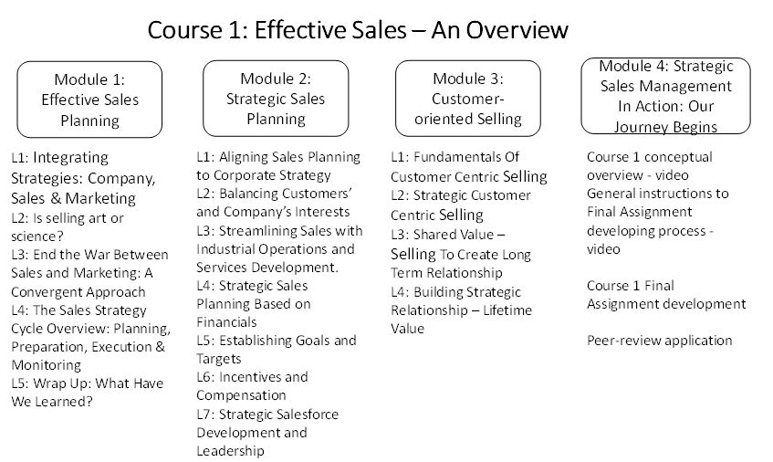
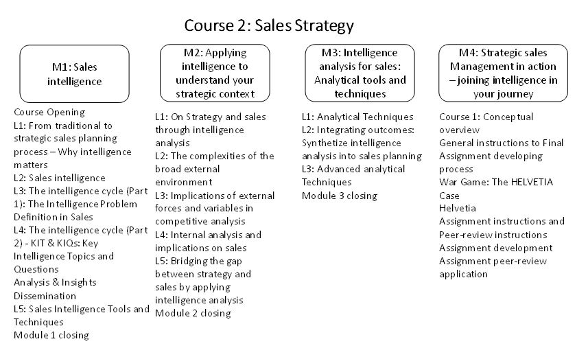
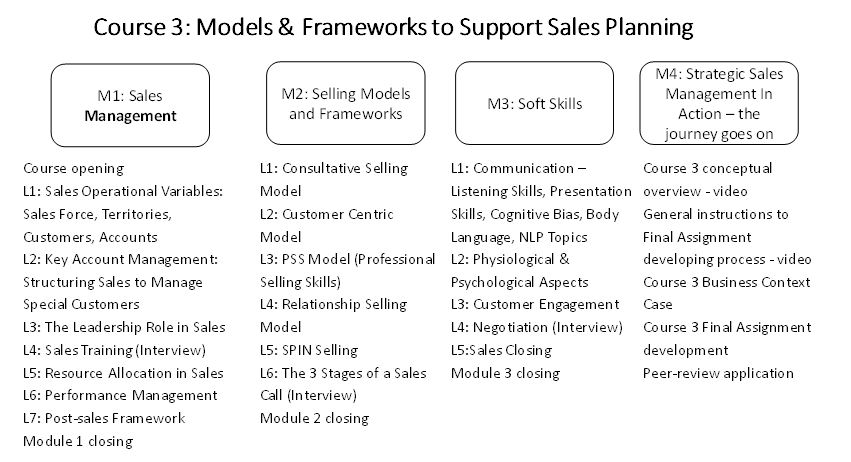
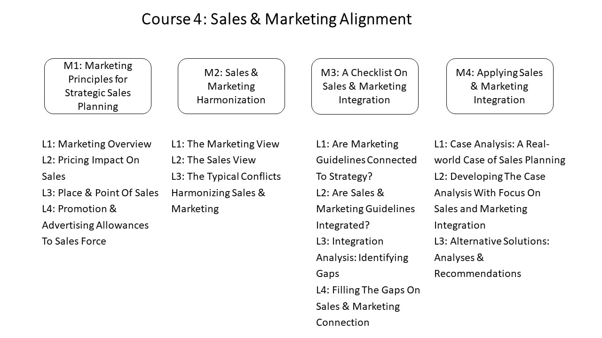

Strategic Sales Management is a specialization structured in five courses and, with the exception of Course 5, each of the other four courses comprises four modules that go through discussions of concepts, methods, and approaches regarding strategic sales planning, management, monitoring, and controlling.

A course is designed to take approximately one month to finish it, with each of the modules taking approximately one week.

The illustrations show the structure of the Strategic Sales Management specialization, presented in the courses. The learning objectives are highlighted for each of the modules within the courses.

**Course 1**

In **Week 1** **–** **Effective Sales Planning** (Module 1), the conceptual approach is to discuss the integration of strategy and the sales, through the company, marketing, and sales. This integration is a top issue for managers and sales function practitioners because the strategic guidelines drive the marketing and sales planning.

Learning objectives of this module are:

Identify the links between strategy and sales, to support sales planning through a strategic view of sales.

Analyze sales process to support defining sales objectives aligned with strategic guidelines.

Evaluate sales processes as an extension of strategy roll-out processes, to apply in the sales planning initial guidelines.

Admittedly, this integration is not always smooth. The discussions of Week 1 are developed on this subject. The senior management responsibilities in strategy analysis, marketing, and sales planning are crucial drivers that can contribute to the integration of strategies within the scope of the company.

A typical dissonance that emerges in this integration process is the conflict between marketing and sales areas. There are recommendations to support the integration, and they are discussed in the sales strategy cycle overview.

In **Week 2** **–** **Strategic Sales Planning** (Module 2), the topics discussed are those that support the alignment of sales planning process to the corporate strategy.

The learning objectives of this module are:

Support sales planning by aligning with corporate strategy

Analyze the alternatives to balance customers' interests with company's interests

Align sales and operations effectively, to streamline the business operations

Apply financial aspects to support sales planning

Apply recommendations to support the definition of goals and targets, and incentives and compensation model.

The concepts discussed in this module are related to approaches that can contribute to developing sales planning processes with a strong connection with the corporate strategy.

**Week 3** **–** **Customer-Oriented Selling** (Module 3) - The activities of this week are about benefits of adopting a customer-oriented selling approach. Not only from the company’s perspective, but also in the sense of a shared value creation with customers, through a long-term relationship.

Learning objectives of this module are:

Analyze the connections between customer-oriented selling and value creation

Apply concepts on customer-centric selling to support strategic sales planning

Support long-term relationship towards a shared value model

Start a lifetime value relationship with strategic customers

The discussions in Module 3 are mostly about recommendations on how to support a strategic customer-centered selling approach, which contributes to creating value through a long-term relationship with customers.

**Week 4 - Strategic Sales Management in Action: Our Journey Begins** (Module 4) - In this module, a final assignment based on a real-life business case is the objective. The activities are focused on the development of a critical analysis of relevant topics that are discussed during the previous three modules of Course 1. The challenges proposed in the assignment are designed to stimulate the application of the concepts.

You will develop the assignment following instructions and question prompts, and by doing this, you’ll be stimulated to remember the concepts, understand their approaches, apply them in the specific contexts of the questions, analyze the results, and evaluate them to support a critical analysis of the results.

**Course 2**

In **Week 1** **–** **Sales Intelligence** (Module 1), the conceptual framework included in this module is the intelligence analysis concepts to support sales planning and management. The discussions go through how intelligence analysis can support the sales function, by providing methods to connect strategy to marketing and sales planning processes.

The learning objectives of this first module of Course 2 are:

Support the transition of traditional to strategic sales planning.

Apply the concepts of sales intelligence to support strategic sales planning.

Support strategic sales planning by applying the intelligence cycle.

In **Week 2** **–** **Applying intelligence to understand your strategic context** (Module 2), the discussions are about how the strategy analysis concepts relate to intelligence analysis, which in turn can contribute effectively in the strategic sales planning process.

The learning objectives of this second module of Course 2 are:

Bridge the gap between strategy and sales through intelligence analysis.

Analyze the external environment and its implications in competitive analysis.

Support the internal analysis and implications on sales.

**Week 3 - Intelligence analysis for sales: Analytical tools and techniques** (Module 3) is aimed to go deeper in the discussions about the intelligence analytical tools and techniques that support sales functions.

The learning objectives of this module are:

Apply the intelligence analytical tools and techniques.

Integrate the results of the analytical tools and techniques applied.

Synthesize intelligence analysis into sales planning.

Apply the war game as an intelligence analysis tool to support strategic sales planning.

**Week 4 - Strategic sales Management in action** **–** **joining intelligence in your journey** (Module 4) – This module focuses on the final assignment of Course 2, and it’s based on a real-life business case to bring the challenge to be analyzed. The emphasis is on critical analysis development of specific subjects related to the contribution that intelligence analysis can provide to the strategic sales planning process.

The assignment is developed by following instructions and question prompts, and in this process, you’ll practice the learning insights that include the cognitive processes:

\- remember the concepts

\- understand their approaches

\- apply them in the specific contexts of the questions and prompts

\- analyze the results, and

\- evaluate them to support a critical analysis of the results.

**Course 3**

In Course 3, the conceptual scope is dedicated to the models and frameworks that support sales planning, from an application standpoint.

In **Week 1 – Sales Management** (Module 1), the concepts discussed are related to the operationalization of the sales functions management, which comprises since the operational variables, the accounts management, leadership aspects, resource allocation, performance management, and post-sales processes. This package of concepts and recommendations support major sales management activities.

The learning objectives of this first module of Course 3 are:

Assess the basics of sales operational variables.

Structure the sales area to support special customers management.

Be aware of and apply conceptual framework of leadership in sales.

Manage the sales training functions to improve training effectiveness.

Support sales performance management planning.

Structure the sales area to manage post-sales activities.

In **Week 2 – Selling Models and Frameworks** (Module 2), the scope of the conceptual package is on the models and frameworks that support the selling planning and management processes. Some of the relevant selling models and frameworks are discussed in this module.

The learning objectives of the module are:

Identify the relevant variables of a portfolio sales planning, and define which sales support model could contribute more in the case

Apply the sales support models to develop strategic sales planning and implementation processes

Identify gaps in the sales models when analyzing them in a specific business context, to support recommendation of alternative models not included in this Module

In **Week 3 – Soft Skills** (Module 3), the concepts discussed are about the set of skills that are related to the human nature and its specific aspects that are not objectively the hard skills one is evaluated.

The learning objectives of this module 3 are:

Be aware of the different communications means and signals, to support information gathering.

Apply the observation methodologies on physiological and psychological aspects to foster communication in the sales process.

Structure a customer engagement process to support the interactions with customers and prospects in the selling process.

Support sales interactions by applying negotiation and sales closing processes recommendations.

**Week 4 - Strategic Sales Management in Action – the journey goes on** (Module 4) – This module focuses on the development of the final mini-project assignment of Course 3.

The assignment is based on a real-life business context that is presented with changes in names, geographic information, and some other characteristics for the sake of confidentiality.

**Course 4**

In Course 4, the conceptual scope is focused on going deep into the marketing and sales alignment, as this represents a critical issue that has to be addressed by managers.

In **Week 1 –** **Marketing Principles for Strategic Sales Planning** (Module 1), the concepts discussed focus on the strategic sales guidelines that are (or should) developed from the marketing principles. And, let's not forget, marketing principles derive from strategic guidelines.

The learning objectives of this first module of Course 4 are:

Recognize the mechanics of Product, Price, Place & Promotion

Understand the interaction in the decisions of each "P" between Sales and Marketing

Put into practice the contributions that should be given by Sales in Product, Price, Place & Promotion, and what can be requested by Marketing

In **Week 2 - Sales & Marketing Harmonization** (Module 2), the emphasis is on the approaches and recommendations to align sales and marketing functions, in a way that enables the integration of sales to the strategy of the company.

The learning objectives of this second module of Course 4 are:

Understand the typical conflicts Sales and Marketing face

Describe the points of view of marketing and sales regarding each other

Explain the respective mindsets behind behaviors and attitudes of marketers and salespeople

In **Week 3 - A Checklist on Sales & Marketing Integration** (Module 3), the discussions are about how to integrate sales and marketing through a set of steps, recommendations, and approaches that apply to make this integration smooth.

The learning objectives of this third module of Course 4 are:

Fully comprehending the crucial role Sales and Marketing alignment have for the success of the businesses

Identifying the level of alignment of the Marketing and sales functions on the respective organizations, and the gaps to be filled

Selecting the most appropriate measures to implement for improving the level of Marketing and Sales alignment

**Week 4 - Applying Sales & Marketing Integration** (Module 4) – This module focuses on the development of the final mini-project assignment of Course 4.

The assignment is based on a real-life business context that is presented with changes in names, geographic information, and some other characteristics for the sake of confidentiality.

**Course 5** – (Still under construction)

And, that's the scope of the starting three course of the Strategic Sales Management specialization.

The facilitators of this course are (in order of appearance):

Samantha Mazzero

James Wright

Cesar Rodrigues

Nelson Yoshida

Edson Ito