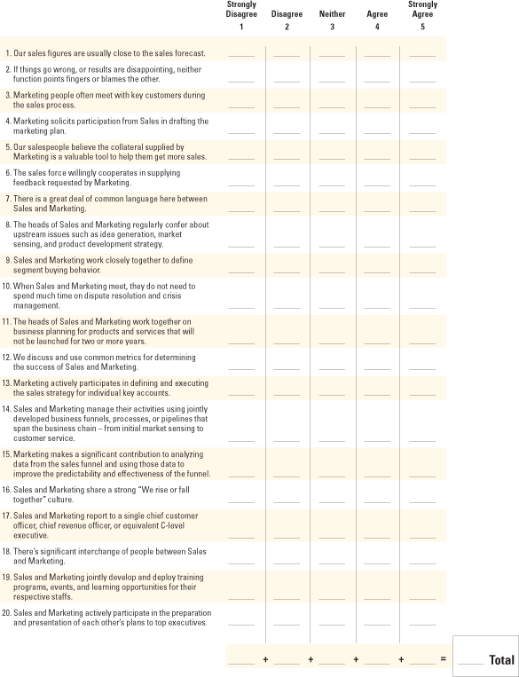
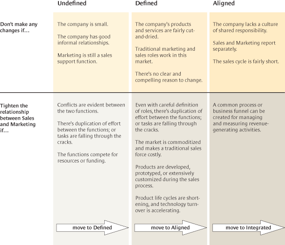
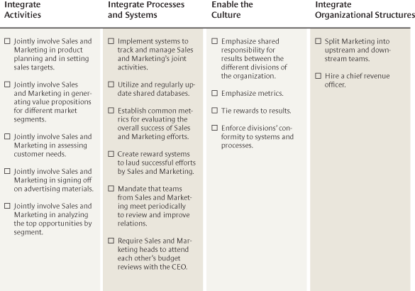
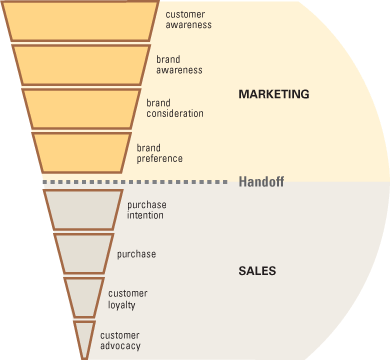

## Kotler, P., Rackham, N., & Krishnaswamy, S. (2006). Ending the war between sales and marketing. Harvard Business Review, 84(7/8), 68.

Available at:

*https://hbr.org/2006/07/ending-the-war-between-sales-and-marketing*

-----------------

Product designers learned years ago that they’d save time and money if they consulted with their colleagues in manufacturing rather than just throwing new designs over the wall. The two functions realized it wasn’t enough to just coexist—not when they could work together to create value for the company and for customers. You’d think that marketing and sales teams, whose work is also deeply interconnected, would have discovered something similar. As a rule, though, they’re separate functions within an organization, and, when they do work together, they don’t always get along. When sales are disappointing, Marketing blames the sales force for its poor execution of an otherwise brilliant rollout plan. The sales team, in turn, claims that Marketing sets prices too high and uses too much of the budget, which instead should go toward hiring more salespeople or paying the sales reps higher commissions. **More broadly, sales departments tend to believe that marketers are out of touch with what’s really going on with customers. Marketing believes the sales force is myopic—too focused on individual customer experiences, insufficiently aware of the larger market, and blind to the future. In short, each group often undervalues the other’s contributions.**

This lack of alignment ends up hurting corporate performance. Time and again, during research and consulting assignments, we’ve seen both groups stumble (and the organization suffer) because they were out of sync. Conversely, there is no question that, when Sales and Marketing work well together, companies see substantial improvement on important performance metrics: Sales cycles are shorter, market-entry costs go down, and the cost of sales is lower. That’s what happened when IBM integrated its **sales and marketing groups to create a new function called Channel Enablement**. Before the groups were integrated, IBM senior executives Anil Menon and Dan Pelino told us, Sales and Marketing operated independent of one another. Salespeople worried only about fulfilling product demand, not creating it. Marketers failed to link advertising dollars spent to actual sales made, so Sales obviously couldn’t see the value of marketing efforts. And, because the groups were poorly coordinated, Marketing’s new product announcements often came at a time when Sales was not prepared to capitalize on them.

Curious about this kind of disconnect between Sales and Marketing, we conducted a study to identify best practices that could help enhance the joint performance and overall contributions of these two functions. We interviewed pairs of chief marketing officers and sales vice presidents to capture their perspectives. We looked in depth at the relationship between Sales and Marketing in a heavy equipment company, a materials company, a financial services firm, a medical systems company, an energy company, an insurance company, two high-tech electronic products companies, and an airline. Among our findings:

- **The marketing function takes different forms in different companies at different product life-cycle stages—all of which can deeply affect the relationship between Sales and Marketing.**

- **The strains between Sales and Marketing fall into two main categories: economic and cultural.**

- **It’s not difficult for companies to assess the quality of the working relationship between Sales and Marketing. (This article includes a diagnostic tool for doing so.)**

- **Companies can take practical steps to move the two functions into a more productive relationship, once they’ve established where the groups are starting from.**

## Different Roles for Marketing

Before we look closely at the relationship between the two groups, we need to recognize that the nature of the marketing function varies significantly from company to company.

Most small businesses (and most businesses *are* small) don’t establish a formal marketing group at all. Their marketing ideas come from managers, the sales force, or an advertising agency. Such businesses equate marketing with selling; they don’t conceive of marketing as a broader way to position their firms.

Eventually, successful small businesses add a marketing person (or persons) to help relieve the sales force of some chores. These new staff members **conduct research to calibrate the size of the market, choose the best markets and channels, and determine potential buyers’ motives and influences. They work with outside agencies on advertising and promotions. They develop collateral materials to help the sales force attract customers and close sales. And, finally, they use direct mail, telemarketing, and trade shows to find and qualify leads for the sales force**. Both Sales and Marketing see the marketing group as an adjunct to the sales force at this stage, and the relationship between the functions is usually positive.

As companies become larger and more successful, executives recognize that there is more to marketing than setting the **four P’s: product, pricing, place, and promotion**. They determine that effective marketing calls for people skilled in **segmentation, targeting, and positioning (STP)**. Once companies hire marketers with those skills, Marketing becomes an independent player. It also starts to compete with Sales for funding. While the sales mission has not changed, the marketing mission has. Disagreements arise. Each function takes on tasks it believes the other should be doing but isn’t. All too often, organizations find that they have a marketing function inside Sales, and a sales function inside Marketing. At this stage, the salespeople wish that the marketers would worry about future opportunities (long-term strategy) and leave the current opportunities (individual and group sales) to them.

All too often, organizations find that they have a marketing function inside Sales, and a sales function inside Marketing.

Once the marketing group tackles higher-level tasks like segmentation, it starts to work more closely with other departments, particularly Strategic Planning, Product Development, Finance, and Manufacturing. The company starts to think in terms of developing brands rather than products, and brand managers become powerful players in the organization. The marketing group is no longer a humble ancillary to the sales department. It sets its sights much higher: The marketers believe it’s essential to transform the organization into a “marketing-led” company. As they introduce this rhetoric, others in the firm—including the sales group—question whether the marketers have the competencies, experience, and understanding to lead the organization.

While Marketing increases its influence within separate business units, it rarely becomes a major force at the corporate level. There are exceptions: Citigroup, Coca-Cola, General Electric, IBM, and Microsoft each have a marketing head at the corporate level. And Marketing is more apt to drive company strategy in major packaged-goods companies such as General Mills, Kraft, and Procter & Gamble. Even then, though, during economic downturns, Marketing is more closely questioned—and its workforce more likely to be cut—than Sales.

## Why Can’t They Just Get Along?

There are two sources of friction between Sales and Marketing. **One is economic, and the other is cultural**. The economic friction is generated by the **need to divide the total budget granted by senior management to support Sales and Marketing**. In fact, the sales force is apt to criticize how Marketing spends money on three of the four P’s—pricing, promotion, and product. Take pricing. The marketing group is under pressure to achieve revenue goals and wants the sales force to “sell the price” as opposed to “selling through price.” The salespeople usually favor lower prices because they can sell the product more easily and because low prices give them more room to negotiate. In addition, there are organizational tensions around pricing decisions. While Marketing is responsible for setting suggested retail or list prices and establishing promotional pricing, Sales has the final say over transactional pricing. When special low pricing is required, Marketing frequently has no input. The vice president of sales goes directly to the CFO. This does not make the marketing group happy.

Promotion costs, too, are a source of friction. The marketing group needs to spend money to generate customers’ awareness of, interest in, preference for, and desire for a product. But the sales force often views the large sums spent on promotion—particularly on television advertising—as a waste of money. The VP of sales tends to think that this money would be better spent increasing the size and quality of the sales force.

When marketers help set the other P, the product being launched, salespeople often complain that it lacks the features, style, or quality their customers want. That’s because the sales group’s worldview is shaped by the needs of its individual customers. The marketing team, however, is concerned about releasing products whose features have broad appeal.

The budget for both groups also reflects which department wields more power within the organization, a significant factor. CEOs tend to favor the sales group when setting budgets. One chief executive told us, “Why should I invest in more marketing when I can get better results by hiring more salespeople?” CEOs often see sales as more tangible, with more short-run impact. The sales group’s contributions to the bottom line are also easier to judge than the marketers’ contributions.

The cultural conflict between Sales and Marketing is, if anything, even more entrenched than the economic conflict. This is true in part because the two functions attract different types of people who spend their time in very different ways. Marketers, who until recently had more formal education than salespeople, are highly analytical, data oriented, and project focused. They’re all about building competitive advantage for the future. They judge their projects’ performance with a cold eye, and they’re ruthless with a failed initiative. However, that performance focus doesn’t always look like action to their colleagues in Sales because it all happens behind a desk rather than out in the field. Salespeople, in contrast, spend their time talking to existing and potential customers. They’re skilled relationship builders; they’re not only savvy about customers’ willingness to buy but also attuned to which product features will fly and which will die. They want to keep moving. They’re used to rejection, and it doesn’t depress them. They live for closing a sale. It’s hardly surprising that these two groups of people find it difficult to work well together.

**Marketers judge their projects’ performance with a cold eye. But that performance focus doesn’t always look like action to their colleagues in Sales.**

If the organization doesn’t align incentives carefully, the two groups also run into conflicts about seemingly simple things—for instance, which products to focus on selling. Salespeople may push products with lower margins that satisfy quota goals, while Marketing wants them to sell products with higher profit margins and more promising futures. More broadly speaking, the two groups’ performance is judged very differently. Salespeople make a living by closing sales, full stop. It’s easy to see who (and what) is successful—almost immediately. But the marketing budget is devoted to programs, not people, and it takes much longer to know whether a program has helped to create long-term competitive advantage for the organization.

## Four Types of Relationships

Given the potential economic and cultural conflicts, one would expect some strains to develop between the two groups. And, indeed, some level of dysfunction usually does exist, even in cases where the heads of Sales and Marketing are friendly. The sales and marketing departments in the companies we studied exhibit four types of relationships. The relationships change as the companies’ marketing and sales functions mature—the groups move from being unaligned (and often conflicted) to being fully integrated (and usually conflict-free)—though we’ve seen only a few cases where the two functions are fully integrated.

### Undefined.

When the relationship is undefined, Sales and Marketing have grown independently; each is preoccupied largely with its own tasks and agendas. Each group doesn’t know much about what the other is up to—until a conflict arises. Meetings between the two, which are ad hoc, are likely to be devoted to conflict resolution rather than proactive cooperation.

### Defined.

In a defined relationship, the two groups set up processes—and rules—to prevent disputes. There’s a **“good fences make good neighbors” orientation**; the marketers and salespeople know who is supposed to do what, and they stick to their own tasks for the most part. The groups start to build a common language in potentially contentious areas, such as “How do we define a lead?” Meetings become more reflective; people raise questions like “What do we expect of one another?” The groups work together on large events like customer conferences and trade shows.

### Aligned.

When Sales and Marketing are aligned, clear boundaries between the two exist, but they’re flexible. The groups engage in joint planning and training. The sales group understands and uses marketing terminology such as “value proposition” and “brand image.” Marketers confer with salespeople on important accounts. They play a role in transactional, or commodity, sales as well.

### Integrated.

When Sales and Marketing are fully integrated, boundaries become blurred. Both groups redesign the relationship to share structures, systems, and rewards. Marketing—and to a lesser degree Sales—begins to focus on strategic, forward-thinking types of tasks (market sensing, for instance) and sometimes splits into upstream and downstream groups. Marketers are deeply embedded in the management of key accounts. The two groups develop and implement shared metrics. Budgeting becomes more flexible and less contentious. A “rise or fall together” culture develops.

We designed an assessment tool that can help organizations gauge the relationship between their sales and marketing departments. (See the exhibit “How Well Do Sales and Marketing Work Together?”) We originally developed this instrument to help us understand what we were seeing in our research, but the executives we were studying quickly appropriated it for their own use. Without an objective tool of this kind, it’s very difficult for managers to judge their cultures and their working environments.

#### How Well Do Sales and Marketing Work Together?

## Moving Up

Once an organization understands the nature of the relationship between its marketing and sales groups, senior managers may wish to create a stronger alignment between the two. (It’s not always necessary, however. The exhibit “Do We Need to Be More Aligned?” can help organizations decide whether to make a change.)

#### Do We Need to Be More Aligned?

### Moving from undefined to defined.

If the business unit or company is small, members of Sales and Marketing may enjoy good, informal relationships that needn’t be disturbed. This is especially true if Marketing’s role is primarily to support the sales force. However, senior managers should intervene if conflicts arise regularly. As we noted earlier, this generally happens because the groups are competing for scarce resources and because their respective roles haven’t been clearly defined. At this stage, managers need to create clear rules of engagement, including handoff points for important tasks like following up on sales leads.

### Moving from defined to aligned.

The defined state can be comfortable for both parties. “It may not be perfect,” one VP of sales told us, “but it’s a whole lot better than it was.” Staying at this level won’t work, though, if your industry is changing in significant ways. If the market is becoming commoditized, for example, a traditional sales force may become costly. Or if the market is moving toward customization, the sales force will need to upgrade its skills. The heads of Sales and Marketing may want to build a more aligned relationship and jointly add new skills. To move from a defined relationship to an aligned one:

#### Encourage disciplined communication.

When it comes to improving relations between any two functions, the first step inevitably involves improving communication. But it’s not as simple as just *increasing* communication between two groups. More communication is expensive. It eats up time, and it prolongs decision making. We advocate instead for more *disciplined* communication. Hold regular meetings between Sales and Marketing (at least quarterly, perhaps bimonthly or monthly). Make sure that major opportunities, as well as any problems, are on the agenda. Focus the discussions on action items that will resolve problems, and perhaps even create opportunities, by the next meeting. Salespeople and marketers need to know *when* and *with whom* they should communicate. Companies should develop systematic processes and guidelines such as, “You should involve the brand manager whenever the sales opportunity is above $2 million,” or “We will not go to print on any marketing collateral until salespeople have reviewed it,” or “Marketing will be invited to the top ten critical account reviews.” Businesses also need to establish an up-to-date, user-friendly “who to call” database. People get frustrated—and they waste time—searching in the wrong places for help.

#### Create joint assignments; rotate jobs.

As your functions become better aligned, it’s important to create opportunities for marketers and salespeople to work together. This will make them more familiar with each other’s ways of thinking and acting. It’s useful for marketers, particularly brand managers and researchers, to occasionally go along on sales calls. They should get involved with developing alternate solutions for customers, early in the sales process. And they should also sit in on important account-planning sessions. Salespeople, in turn, should help to develop marketing plans and should sit in on product-planning reviews. They should preview ad and sales-promotion campaigns. They should share their deep knowledge about customers’ purchasing habits. Jointly, marketers and salespeople should generate a playbook for expanding business with the top ten accounts in each market segment. They should also plan events and conferences together.

#### Appoint a liaison from Marketing to work with the sales force.

The liaison needs to be someone both groups trust. He or she helps to resolve conflicts and shares with each group the tacit knowledge from the other group. It’s important not to micromanage the liaison’s activities. One of the Marketing respondents in our study described the liaison’s role this way: “This is a person who lives with the sales force. He goes to the staff meetings, he goes to the client meetings, and he goes to the client strategy meetings. He doesn’t develop product; he comes back and says, ‘Here’s what this market needs. Here’s what’s emerging,’ and then he works hand in hand with the salesperson and the key customer to develop products.”

#### THIS ARTICLE ALSO APPEARS IN:

- 

  ###### [https://hbr.org/2006/07/ending-the-war-between-sales-and-marketing#)

  

#### Colocate marketers and salespeople.

It’s an old and simple truth that when people are physically close, they will interact more often and are more likely to work well together. One bank we studied located its sales and marketing functions in an empty shopping mall: Different groups and teams within Sales and Marketing were each allocated a storefront. Particularly in the early stages of moving functions toward a more closely aligned relationship, this kind of proximity is a big advantage. Most companies, though, centralize their marketing function, while the members of their sales group remain geographically dispersed. Such organizations need to work harder to facilitate communication between Sales and Marketing and to create shared work.

#### Improve sales force feedback.

Marketers commonly complain that salespeople are too busy to share their experiences, ideas, and insights. Indeed, very few salespeople have an incentive to spend their precious time sharing customer information with Marketing. They have quotas to reach, after all, and limited time in which to meet and sell to customers. To more closely align Sales and Marketing, senior managers need to ensure that the sales force’s experience can be tapped with a minimum of disruption. For instance, Marketing can ask the Sales VP to summarize any sales force insights for the month or the quarter. Or Marketing can design shorter information forms, review call reports and CRM data independently, or pay salespeople to make themselves available to interviewers from the marketing group and to summarize what their sales colleagues are thinking about.

### Moving from aligned to integrated.

Most organizations will function well when Sales and Marketing are aligned. This is especially true if the sales cycle is relatively short, the sales process is fairly straightforward, and the company doesn’t have a strong culture of shared responsibility. In complicated or quickly changing situations, there are good reasons to move Sales and Marketing into an integrated relationship. (The exhibit “Sales and Marketing Integration Checklist” outlines the issues you’ll want to think through.) This means integrating such straightforward activities as planning, target setting, customer assessment, and value-proposition development. It’s tougher, though, to integrate the two groups’ processes and systems; these must be replaced with common processes, metrics, and reward systems. Organizations need to develop shared databases, as well as mechanisms for continuous improvement. Hardest of all is changing the culture to support integration. The best examples of integration we found were in companies that already emphasized shared responsibility and disciplined planning; that were metrics driven; that tied rewards to results; and that were managed through systems and processes. To move from an aligned relationship to an integrated one:

#### Appoint a chief revenue (or customer) officer.

The main rationale for integrating Sales and Marketing is that the two functions have a common goal: the generation of profitable and increasing revenue. It is logical to put both functions under one C-level executive. Companies such as Campbell’s Soup, Coca-Cola, and FedEx have a chief revenue officer (CRO) who is responsible for planning for and delivering the revenue needed to meet corporate objectives. The CRO needs control over the forces affecting revenue—specifically, marketing, sales, service, and pricing. This manager could also be called the chief customer officer (CCO), a title used in such companies as Kellogg; Sears, Roebuck; and United Air Lines. The CCO may be more of a customer ombudsman or customer advocate in some companies; but the title can also signal an executive’s broader responsibility for revenue management.

#### Sales and Marketing Integration Checklist

#### Define the steps in the marketing and sales funnels.

Sales and Marketing are responsible for a sequence of activities and events (sometimes called a funnel) that leads customers toward purchases and, hopefully, ongoing relationships. Such funnels can be described from the customer’s perspective or from the seller’s perspective. (A typical funnel based on the customer’s decision sequence is shown in the exhibit “The Buying Funnel.”) Marketing is usually responsible for the first few steps—building customers’ brand awareness and brand preference, creating a marketing plan, and generating leads for sales. Then Sales executes the marketing plan and follows up on leads. This division of labor has merit. It is simple, and it prevents Marketing from getting too involved in individual sales opportunities at the expense of more strategic activities. But the handoff brings serious penalties. If things do not go well, Sales can say that the plan was weak, and Marketing can say that the salespeople did not work hard enough or smart enough. And in companies where Marketing makes a handoff, marketers can lose touch with active customers. Meanwhile, Sales usually develops its own funnel describing the sequence of selling tasks. Funnels of this kind—integrated into the CRM system and into sales forecasting and account-review processes—form an increasingly important backbone for sales management. Unfortunately, Marketing often plays no role in these processes. Some companies in our study, however, have integrated Marketing into the sales funnel. During prospecting and qualifying, for instance, Marketing helps Sales to create common standards for leads and opportunities. During the needs-definition stage, Marketing helps Sales develop value propositions. In the solution-development phase, Marketing provides “solution collateral”—organized templates and customizing guides so salespeople can develop solutions for customers without constantly having to reinvent the wheel. When customers are nearing a decision, Marketing contributes case study material, success stories, and site visits to help address customers’ concerns. And during contract negotiations, Marketing advises the sales team on planning and pricing. Of course, Marketing’s involvement in the sales funnel should be matched by Sales’ involvement in the upstream, strategic decisions the marketing group is making. Salespeople should work with the marketing and R&D staffs as they decide how to segment the market, which products to offer to which segments, and how to position those products.

#### The Buying Funnel

#### Split Marketing into two groups.

There’s a strong case for splitting Marketing into upstream (strategic) and downstream (tactical) groups. Downstream marketers develop advertising and promotion campaigns, collateral material, case histories, and sales tools. They help salespeople develop and qualify leads. The downstream team uses market research and feedback from the sales reps to help sell existing products in new market segments, to create new messages, and to design better sales tools. Upstream marketers engage in customer sensing. That is, they monitor the voice of the customer and develop a long view of the company’s business opportunities and threats. The upstream team shares its insights with senior managers and product developers—and it participates in product development.

#### Set shared revenue targets and reward systems.

The integrated organization will not succeed unless Sales and Marketing share responsibility for revenue objectives. One marketing manager told us, “I’m going to use whatever tools I need to make sure Sales is effective, because, at the end of the day, I’m judged on that sales target as well.” One of the barriers to shared objectives, however, is the thorny issue of shared rewards. Salespeople historically work on commission, and marketers don’t. To successfully integrate the two functions, management will need to review the overall compensation policy.

#### Integrate Sales and Marketing metrics.

The need for common metrics becomes critical as Marketing becomes more embedded in the sales process and as Sales plays a more active role in Marketing. “In order to be the customer-intimate company we are,” says Larry Norman, president of Financial Markets Group, part of the Aegon USA operating companies, “we need to be metrics driven and have metrics in place that track both sales and marketing performance.” On a macro level, companies like General Electric have “the number”—the sales goal to which both Sales and Marketing commit. There is no escaping the fact that, however well integrated Sales and Marketing are, the company will also want to develop metrics to measure and reward each group appropriately.

#### THIS ARTICLE ALSO APPEARS IN:

- 

  ###### [HBR’s 10 Must Reads on Strategic Marketing](https://hbr.org/product/hbr-s-10-must-reads-on-strategic-marketing-with-featured-article-marketing-myopia-by-theodore-levitt-hbr-s-10-must-reads/an/11366-PBK-ENG?referral=02560)

  **Book** 

  24.95[View Details](https://hbr.org/2006/07/ending-the-war-between-sales-and-marketing#)

  

Sales metrics are easier to define and track. Some of the most common measures are percent of sales quota achieved, number of new customers, number of sales closings, average gross profit per customer, and sales expense to total sales. When downstream marketers become embedded in the sales process—for example, as members of critical account teams—it’s only logical to measure and reward their performance using sales metrics. But then how should the company evaluate its upstream marketers? On the basis of the accuracy of their product forecasting, or the number of new market segments they discover? The metrics will vary according to the type of marketing job. Senior managers need to establish different measures for brand managers, market researchers, marketing information systems managers, advertising managers, sales promotion managers, market segment managers, and product managers. It’s easier to construct a set of metrics if the marketers’ purposes and tasks are clearly outlined. Still, given that upstream marketers are more engaged in sowing the seeds for a better future than in helping to reap the current harvest, the metrics used to judge their performance necessarily become softer and more judgmental.

Obviously, the difference between judging current and future outcomes makes it more complicated for companies to develop common metrics for Sales and Marketing. Upstream marketers in particular need to be assessed according to what they deliver over a longer period. Salespeople, meanwhile, are in the business of converting potential demand into today’s sales. As the working relationship between Sales and Marketing becomes more interactive and interdependent, the integrated organization will continue to wrestle with this difficult, but surely not insurmountable, problem.• • •

Senior managers often describe the working relationship between Sales and Marketing as unsatisfactory. The two functions, they say, under communicate, underperform, and overcomplain. Not every company will want to—or should—upgrade from defined to aligned relationships or from aligned to integrated relationships. But every company can and should improve the relationship between Sales and Marketing. Carefully planned enhancements will bring salespeople’s intimate knowledge of your customers into the company’s core. These improvements will also help you serve customers better now and will help you build better products for the future. They will help your company marry softer, relationship-building skills with harder, analytic skills. They will force your organization to closely consider how it rewards people and whether those reward systems apply fairly across functions. Best of all, these improvements will boost both your top-line and bottom-line growth.

A version of this article appeared in the [July–August 2006](https://hbr.org/archive-toc/BR0607) issue of *Harvard Business Review*.

------

Philip Kotler is the S.C. Johnson & Son Distinguished Professor of International Marketing at Northwestern University’s Kellogg School of Management in Evanston, Illinois. This is his 11th article for HBR.

------

Neil Rackham is a visiting professor at the University of Portsmouth in England, the author of Spin Selling (McGraw-Hill, 1988), and a coauthor of Rethinking the Sales Force (McGraw-Hill, 1999).

------

Suj Krishnaswamy ([sujk@stinsights.com](mailto:sujk@stinsights.com)) is the founder and a principal of Stinsights (www.stinsights.com), a Chicago-based business strategy and market research firm specializing in sales-marketing interface.