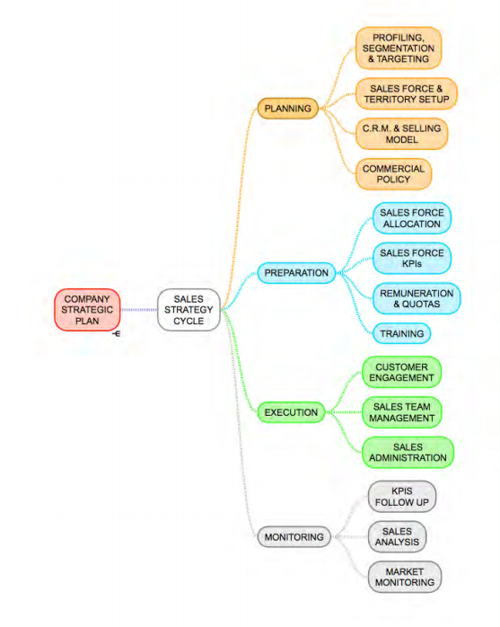

## Sales Strategy Cycle: Planning, Preparation, Execution & Monitoring. A Framework for Integrating a Sales Strategy Cycle into a Company’s Strategic Plan - Cesar Rodrigues. Promktg, 2017

## **http://nebula.wsimg.com/2c5864f3abbd620433ea6aa983639248?AccessKeyId=C8FBF29B5CF1AAF77033&disposition=0&alloworigin=1**

---------------

