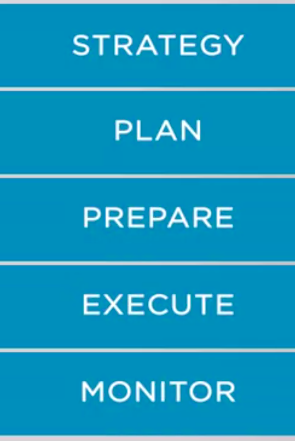
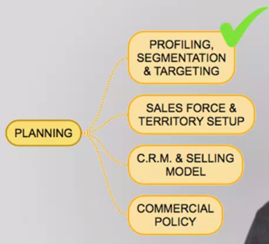

### The Sales Cycle-Part1

When you're a sales rep, you see bits and pieces of the sales cycle. You are involved in the execution and monitoring phase mostly from a doer standpoint. 

Now it is a different story. You take a top down approach to get a broader vision. If sales persons are like
soldiers on the front with a limited view of the battleground. Now, it is time for
you to hop on a helicopter and see everything that is going on. You must define a strategy, plan,
prepare, execute and monitor. A big responsibility. Let's look at the four phases of the cycle, **planning, preparation, execution and monitoring**. 

Before the sales strategy cycle starts, there is something crucial that should be in place. That is the company **strategic plan that includes the sales strategy**. The company strategic plan is
prepared by the senior management, directors for all departments and the president or CEO.. The company's strategic plan has several sections, and one of them is the sales strategy. 

Who oversees the sales strategy? That will be the sales director. 

Who will prepare the strategy document? And obtain endorsement by senior management in the president or the CEO.

This **plan sets the major guidelines for the organization, its mission, vision, long and short term objectives and the strategic directions**

Let's look at how the cycle works. First comes the planning phase. 

Planning starts by **profiling, segmentation and targeting**. Mapping customers,
dividing them in segments and choosing which ones we will approach or we will target. Let's say we will profile our customers based on family annual income. We can say we can split them,
or segment them in four ranges. Less than $50,000, between 51 and 75,000, from 76 to $99,000, or above $100,000. In the case of business to business,

**B2B, we can do the same using sales per year for the customers instead of family income**. 

For the sake of an example, let's say we choose to target those customers who are in the range of $100,000 a year or more. When this step is complete, then we will mapped who are the prospects and where they are.

The next step then is sales force and territory setup. Defining geographically the segments
of customers that we are targeting. 

Here, you will determine how many sales persons you will need to cover the territories you choose to serve. 

This works for salespeople, we will have face to face interaction. And those who will call on customers remotely as from a call center. 

Now, there are two important elements that we have to define, the CRM, customer relationship management system, your force is going to work with. And what will be the selling
model to be employed. We will get into more details later.

To finish the planning phase,we will work on the **commercial policy**. 

The commercial conditions, such as **margins, discounts, rebates, terms, and credit criteria, for
each client or type of client**. And this completes the planning. A crucial phase that
will define everything that will come next in the sales strategy cycle

