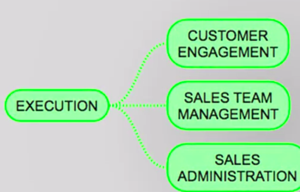

### The Sales Cycle-Part2

Last time, we talked about the four phases of the cycle. Planning, preparation,
execution and monitoring. We said that before this all starts, the company's strategic plan must be in place. And part of the strategic plan is the sales strategy. We visit the first phase of the cycle,
the planning, in detail. When it's completed, we move to the preparation, the second phase. It may sound like planning and preparation are the same thing, not quite. 

Planning deals with decisions that will shape all the other phases. Discussions in decisions here,
can be lengthy and can take a few months. 

In preparation, we deal with more practical aspects. Setting things in motion. It may take some weeks to conclude.

The first step, we will look at our sales force and the territory structure that has been decided. We call this step **sales force allocation**. 

Are there territories that are vacant, where you must hire someone? Here, is also when the sales supervisors, also called frontline managers, will be chosen and allocated to oversee a given number of salespeople.

Now, there are three definitions you must make. 

How will you measure the sales force activity, is the first. You should select KPIs, or key performance indicators. Key performance indicators are metrics that deal with the number of clients called per day,
frequency of client visits, or coverage by customer segment, for example.

 The second decision you must make is about the sales quota each territory or sales person will receive.

The third, how are you going to pay and reward your sales force? What percentage of the salary will be
fixed and what part will be variable? The bonuses.

Finally, you must prepare your teams to execute. 

And this is done during training meetings, where the sales force gets the action plans from marketing. Receives instruction about their products or services. And draw the sales tactics along with their managers.

-----------

Now, is the time when the rubber meets the road. Execution, the third phase.

In this phase, the most important step of the whole cycle happens, customer engagement. 

When clients are called and sales are made, or not. Being effective at this point is of paramount importance and, as you see later, many different selling models are available to be employed at this moment. The sales force has a big responsibility in the execution of the plans, and equally important, it must report to headquarters when strategies, tactics, or plans are not working. 

Let's use a metaphor. Say, the strategy is in the brain and it signals for the hand for the execution of this action. Hold that metal bar. If the metal bar is hot, then the hand must immediately tell the brain it's too hot. The nervous system will make the hands release the bar. And now the brain knows an important piece of information. If the hand does not tell the brain, not only the hand gets burned, the whole body, or the company, suffers the consequences. 

There are two steps that go along with customer engagement, team management and sales administration. 

Team management is performed by the first line manager, or front line manager, who orchestrates
his sales teams action plans, provide support for each sales person, and makes sure that KPIs are in
line with what was planned. 

Sales administrations has to do with placing the customer's order, following up on deliveries, and providing services to the customers when necessary.

------------------

We get to the fourth phase of the sales strategy cycle, monitoring. 

Monitoring is also essential. The things that you want to continually examine in this phase are, first, sales. Are the quotas being met? Do the trends show sales objectives would be accomplished? Do we need to adjust forecast? 

Next, market and competitors. Are we gaining market share? 

Are there any unforeseen actions by competition? 

And KPIs. Are the KPIs goals being met? If not, what is the reason? 

Why we must monitor and analyze? Well, we need to be sure results are being achieved. Understand the deviations and its causes. In other words, make a diagnosis. And design corrective action
plans to be deployed. 

The continuous monitoring will provide inputs for the next planning phase, the sale strategy cycle starts over again. 

