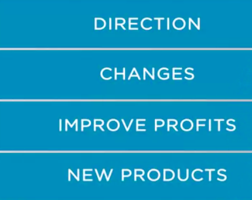
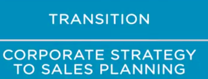
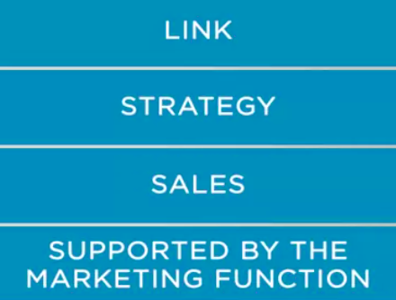
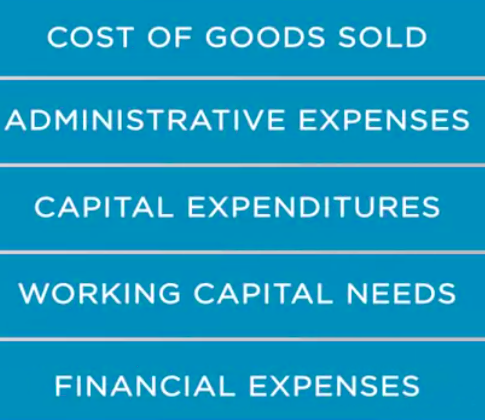
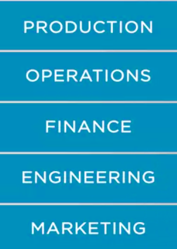
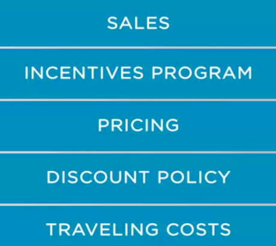
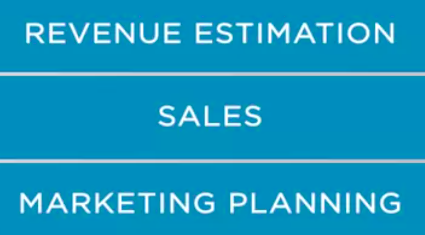

### Sales_planning_in_alignment_to_corporate_strategy

It's been discussed before that important subject of **integrating strategy involves
the company's marketing and sales function**. Some of the topics discussed previously are related to the corporate goals of the company. And these goals look at the medium to long-term origin. Ideally, the **goal should be aligned with the strategic guidelines**. Corporate manager depend on strategic guidelines to define the corporate strategy. **Long-term programs give the direction of the company changes necessary to improve profits, the pipeline of new products**,and other strategic issues that company managers should
address for next years to come. 

So one of the consequence of the corporate strategy is that they seek often to improving profits and
cash generation potential. 

Therefore, at the corporate level strategy, some of the objectives are related
to the cash flow and earnings, which leads corporate executives to establish goals such as beat the margin, expected cash flow, or earnings per share. These goal are broad financial indicators that can be achieved by a series of programs,projects, and actions at the business level,which means that business unit's level. 

This programs and projects lead executives to establish primary revenue goals. And at the business level, **revenue come from product and service sales. And here is the link between corporate strategy and sales**. So the subject under analysis is the transition from corporate strategy to sales planning. In other words, it's the discussion about how it should operationalize the alignment of sales planning to the corporate strategy. 

Again, it's important to remember that the link between a strategy and sales function is supported by the marketing function. 

How is it done? By integrating strategic marketing and sales to generate  strategic to sales plan. And one important step of this integration is the sales planning process. When asking about how to integrate the sales to strategy, most people would say that it's basically through the sales revenue. That means **manager would plan the expected revenue accordingly to the corporate strategy guidelines. And then the sales planning should include all discussions about program, and project that could support achievement of the expected revenue level**. **So to operationalize a sales planning integrate to corporate strategy, manager should estimate the revenue level that aligns with the corporate strategy.** For example, the strategic guideline could set a goal for **Ebitda margin ** at stock. As it's a margin indicator transitioned from the corporate level strategy to the business level by looking at the revenue and the cost. Sales planning process would focus on the relationship between revenues and costs to serve, for example, by defining the sales incentives programs. Of course, there are other factors to analyze, such as the cost of goods sold, the administrative expense, capital expenditures, working capital needs, and financial expense. 

This topic would be managed by the different areas of the company like production, operations, finance,
engineering, and marketing. 

Specifically for sales area, the items to be addressed are the incentives program, pricing, discount policy,
traveling costs. 

And also the addition of attributes that would or would not make part of the solution offered to the customers. A similar rationale would apply in the case of **expected cash flow** at the corporate level. In this case, manager would be analyzing the potential of the revenue generation. And since the revenue is
the consequence of products and services sold to the customer, the transition between corporate strategy and sales planning is very straightforward,in this case. 

In the sales planning process,manager would be estimating the volumes or amounts of product and services necessary to achieve the revenue goals. Estimation of revenue is a typical process of the sales and marketing planning process. That's why it's recommended to keep a close connection with the corporate planning process. And this process includes the transition from corporate strategy to business unit strategy. Analysis and formulation which eventually will go through the sales and budgeting planning. That's how corporate strategy shapes the sales planning process. 