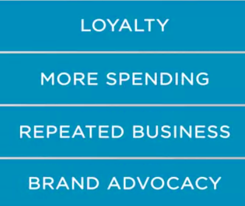

### The convergence of company's and customers' interests

Balancing customer and company's interests. The search for the balance between the interest of the company and the clients has been the subject of much recent research. Assuming that companies can balance customer expectations and business needs, they would end up either displeasing their customer or causes loss to themselves. With companies being more and more customer oriented, it has become essential to companies provide the highest level of customer service they possibly can. Excellent service enhances customer experience which in turn translates to loyalty, more spending, repeated business and brand advocacy from the customers.

In trying to balance customer and business needs, many companies think that they are doing a good job. But belief is not enough. Companies need to listen to clients, to understand if they are meeting their needs. 

In trying to balance customer and business needs, many companies think that they are doing a good job. But belief is not enough. Companies need to listen to clients, to understand if they are meeting their needs. Over the last few years, important business journals have published research and analysis debating the gap between corporate belief in offering the best products and service and the perception of excellence by customers. This is a strong implication. Many companies seem to be in successful in balancing customer expectations and business interests. But before starting to rebuild, reshape or rethink their products and service, corporations needs to have a better understanding of their own business, their products and service. And only then evaluate if they have the right customer portfolio. 

This is part of the equation. It is not only a matter of adjusting to the client but if during the time that company has made an adequate job in capturing the right target for the business. Sometimes companies fail in analyzing the marketing and defining the right segment to focus their promotion and sales efforts. If this is the case, the company needs to come back to their segmentation, targeting and positioning process and start all over again. If the enterprise concludes that this is not the case, it is time to listen in to the client to understand the gap. The fact is that the demands on customer service have increased exponentially and with rising competition, companies must adapt. However **so that corporations do not incur losses while serving customers, they must have strategies in place that will help them in balancing customer expectations and business needs and manage all the aspects of customer service, while ensuring low cost and as little disruption as possible to the process of the business.**

The expectoration at both ends must be realistic and doable for a long lasting and mutual beneficial customer-company relationship. Both sides are equally important and unless companies find a way of balancing customer expectation and business needs. They will either provide poor service to customers or incur enormous cost in efforts to provide the service that the clients expect. The act of balancing both sides is possibly one of the trickiest challenge for any company. And we have not even discussed the competition impact. When taking this in account, **companies have to take extra measures to boost customer service level to raise the satisfaction levels aimed at gaining customer loyalty.** And again, the extra care in managing limited resources and profit is avoiding rise expenses is mandatory to company interests. 

