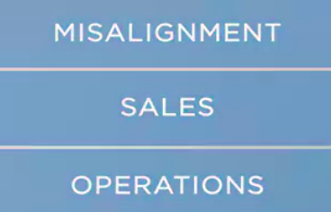
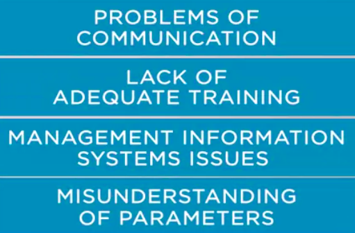

### Streamlining_ ales and industrial services operations

The issue of streamline sales function with industrial and service operations. Why is this important? It is important because the misalignment between sales and operation leads the company to lose money. It's as simple as that. 

Have you ever experience such situation like this? A salesperson closes deal with a customer,
however, the conditions to fulfill the delivery are beyond your capacity. The situation I just described is another serious conflict between sales and other areas of the company. As some say, salespeople have to sell. Salespeople have to sell what the company can deliver at a given level of quality. Others might say, do you remember the discussion on marketing and sales conflict?
One classic that some marketing people like to say about salespeople is, overpaid order takers who will promise almost anything to get the business. 

To counterbalance, let's take the example of something that some salespeople might say
about marketing people. Tower big-picture people with no clue as to what customers need. 

 Can you imagine industrial or services operations people having similar dissonance with salespeople? Of course you can. So the issue under discussion here is the misalignment of sales function with company operations. 

Whenever this misalignment occurs, managers have to tackle the challenges caused by it. Which may include **mobilizing additional resources to deliver the order**,
**paying an extra fee to comply with the delivery time that is above the
capacity of a regular business director**. 

**And even changing procedures in the operations that cost a lot regarding machinery setup or delaying production of regular products of the portfolio.** There are so many impacts that it would take too much time to discuss

The idea of this session is to highlight the issue and propose approaches to tackle the problem
and mitigate the consequences. We will talk about three that may demand extra care. 

One, **lead-time challenge. **

One typical issue regarding this subject under discussion is the lead-time. Most salespeople check
with the operations people if the company can deliver at customers' expected time. And they do it before closing the deal. However, the perfect world is something that doesn't exist. Problems of communication,
lack of adequate training, management information systems issues, or even a plain old fashion misunderstanding of parameters and products or services attributes can lead to a gap between what the customer expects and what the company can deliver. 

If this is the case, managers should make efforts **to categorize what the issues are and analyze the priority order to tackle each of these issues**. A good approach is to **recurrently discuss this matter in the budget planning process**. Because during this activity there's more integration between sales and operations managers. Basically, salespeople should know the lead times for each component of the company's portfolio.

The second consequence is the **product or service scope misalignment**. 

Have you seen customers trying to explain that the scope of the solution delivered is not in alignment to what was agreed in the negotiation process? Probably, but if you haven't had this experience, be aware that you may in the future. This situation is a classical one that of course is special in companies that provide services in specialized professional expertise areas. Again, the source of the problem may be
**communication issues, lack of training, attributes and parameter misunderstanding
and even some information exchange limitation between customers and
sales representatives**. One way to avoid this problem is to invest in salespeople training. Most of the issues can be prevented by having well-prepared salespeople. Remember, we are talking about
service providing which involves many tangible aspects that are a challenge to communicate to customers. Talk to people of the operations area. They know what they can or cannot do. **If what the company can't do what most of the customers demand, then maybe it's time to involve marketing and operations people to adjust the portfolio or to launch other products with improved service level agreement terms.** Whatever the actions, try to take them in advance to avoid having to mitigate the consequence
of a gap between what was sold and what was expected by the customer. 

The third consequence is **sales quotas issue**. 

A source of a problem regarding the misalignment between what is sold and what is the customer expecting is the **performance management model**, which is related to the sales quotas. Sometimes salespeople sell solution A instead of B because their quota for A hasn't been met yet and some of the
customers need solution B instead of A. Does this happen in your company? This situation occurs when managers establish goals based on volumes, units sold, or contracts closed. 

Whenever this happens, I double-check on misalignment between what customers expect and
what salespeople sell as needed. Chances of the situation happening increase when physical
quotas are in place. For more about to this subject, see the references. We have seen in the session
the issue regarding streamlining sales function with industrial and services operation. In the next session, we will go through the sales planning process, based on financial aspects.

**References**

Shim, Jae K., Sales management: Products and services. Global Professional Publishing, 2012.

Rackham, N. Major account sales strategy. McGraw-Hill, Inc., 1989.

Hanan, M. Consultative selling 8th ed. The Hanan formula for high-margin sales at high levels. American Management Association, 2011.