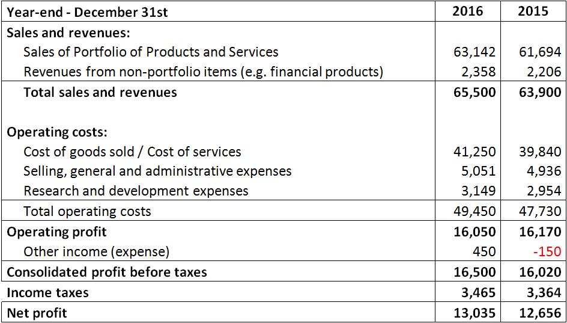
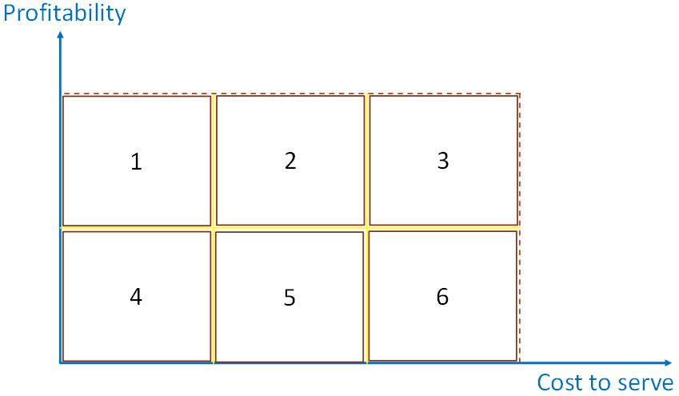
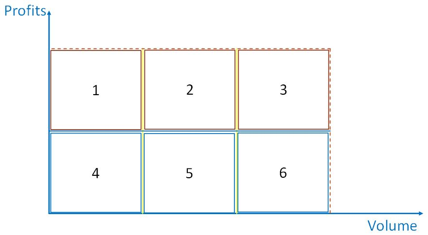

**Sales planning and financial aspects -II**

When thinking about sales and financial aspects, there are some recommendations on how to support sales planning, and in this sense, financial aspects play a key role.

Sales are the cause of revenue, without sales the company doesn't have revenue, which means the strategic objectives can't be achieved.

Sales imply a natural discussion on the results, like the return on investments, in case the company's portfolio includes projects for customers.

Also important to mention, financial aspects are not only related to the company's internal indicators, like minimum return on investment or profits and losses (P&L).

They are also related to the external environment, as we saw in the previous sessions. Customers financial conditions also play a relevant role in the analysis, because these conditions shape some key variables of the company. The credit level and the average collection period are examples of some of these variables.

A sales manager with increased responsibilities should bring financial aspects to the discussion, to support sales planning process.

Here are some practical recommendations that may be useful to do it. They don't include the return on investment because this indicator is easier to analyze. Why? That's because when the sales area is required to participate in discussions regarding a project to a customer, the financial aspects of the project are straightforward indicators, such as the mentioned ROI (return on investment), the net present value (NPV) or the payback.

These indicators are straightforwardly applied to support decision-making of projects to be offered to customers.

A typical discussion of these indicators involve a baseline for each of the indicators, for example, managers may decide not to approve a project that has an estimated ROI lower than 14.5% for a specified period. Alternatively, they might choose not to support a project that presents a payback period of more than five years.

These examples are cases of applying a corporate level policy regarding the return to the company. The analysis of the projects is typically developed by a multiarea team, with professionals from finance, production, operations, marketing, and sales areas.

The cases discussed above are examples in which sales managers participate directly in the decision-making process. And this process is case sensitive, which means each case is analyzed to its core aspects. By consequence, the level of analysis in these cases is deep, and whoever gets involved in these discussions can have the opportunity to contribute directly to the decision.

In contrast, sales managers also have to take into consideration the financial aspects that are not as directly related to sales as the ones described above. And these aspects may demand some dedication to assess because they are not as directly associated with sales function as the ones described before.

Therefore, the focus of this session is on these latter financial aspects.

**Profits and losses (P&L)**

Like we've seen, many sales plans focus on volumes or units sold. As most people can readily perceive numbers like these because they are tangible, some of the goals and targets established for sales teams are expressed in units or volumes.

There's nothing wrong with this approach, provided that a P&L analysis is available and its results have been considered to support sales planning. Of course, selling with no management of profits and losses would be a mistake. The sales manager should keep attention to this subject, even in the cases when managers of other areas of the company, such as marketing and finance, have already addressed the P&L.

A typical P&L analysis is similar to an income statement analysis. It starts with the sales revenue, then deducts the costs, and the profit is available.

Admittedly, this approach is a simple one, but it reflects the basic concept.

A slightly more detailed view would show the P&L analysis including deduction of:

\- Cost of goods sold (COGS) or Cost of Services (COS)

\- Cost of selling, general and administrative (SG&A) expenses

These cost items are the major ones when analyzing P&L for products or services portfolios.

The table below illustrates the application of P&L.

As mentioned before, it starts with the revenue of products or services that comprise the company's portfolio.

There is also the revenue from non-portfolio items, which may come mainly from financial products, such as the ones associated with the financing instruments to support the sales function.

The immediate deductions applicable are the cost of goods sold or cost of services, then the selling, general, and administrative expenses (SG&A).

The cost of goods sold is a straightforward cost item; it represents the direct materials, direct labor, and manufacturing overhead costs that the company incurs to produce the goods.

The selling, general, and administrative (SG&A) expenses are related to incentives programs to stimulate salespeople to sell, and administrative expenses that are related to the administration functions performed either by the sales back office teams, or marketing analysis staff.

Another way of using financial aspects as a baseline to sales planning is to **analyze the relationship between the profitability and the cost to serve customers.**

This approach applicability is typically for business to business (B2B) markets, where the business model may be of medium to long-term contracts with customers.

Sales managers should care about this relationship due to some typical misconceptions. For instance, people tend to think that high-value contracts are always good, and low-value contracts are always bad; however, **not all high-value contracts are profitable, and not all low-value contracts are non-attractive for the company.**

Therefore, it would be great to know more precisely if a sale brings good results for the company.

The illustration below shows how to support sales planning through this method.

When serving a customer in a contract based model, it's likely that managers have updated data regarding ongoing programs, projects and activities to serve the customers. At least, this is something that is expected to be available in any company.

By consequence, the costs to serve may be available, which allows managers to evaluate the relationship between profits and costs to serve. If the company is not at this level of contract management, possibly there are projects to implement processes to support this activity.

Look for these projects, and support them. The sales area will benefit a lot of this approach.

That said, a sales professional can readily conclude that the relationship between profitability and costs to serve may be a powerful tool to support sales planning. Therefore, customers can be located in the chart so that the distribution of customers along the graph supports an analysis of which customers present a better profitability to the costs-to-serve relation.

The clients that present higher profitability and acceptable levels of costs to serve are the best to keep. Whereas the customers that present low profitability and higher costs to serve should eventually be dropped. This method can demystify the common misconception mentioned before, which allows managers to develop the sales planning process with more accurate data.

**This approach demands historical data, on existing customers. Therefore, for new prospects, managers have to do an estimation.**

Consider also that the method can be applied not only to B2B markets context but also in case managers adopt a **product lines portfolio management, with targets on different segments of customers.** An aggregated segment analysis may be developed, and managers could estimate which of the segments presents better profitability versus costs to serve relation.

This evaluation is not completely blind since sales managers know the customer profiles, and they could estimate the potential of each customer.

They also are aware of their portfolio and what would be the potential ratio of revenue, profit, and cost to serve a new customer of the same profile.

By applying this method, managers can develop the sales planning based on the position each customer, or prospect is located in the chart. Or would be located, if the analysis is about a prospect.

An adaptation of this method is also applicable.

It's about the **profitability and volumes**, which is illustrated by the chart below.

In this approach, managers can see that a similar evaluation process can point which customers are more valuable to the company. Sales managers should remember that not all high-volume customers are profitable, and not all low volumes customers are unattractive.

Both methods contribute to sales planning, by identifying the valuable customers.

The decision to serve which customer is a subject to be discussed at the executive level. Of course, sales managers play a vital role in this process, and the value they add is as higher as they apply the financial aspects to support the process.

There'll always be a strategic view on the table, which means some of the not so valuable customers will still be kept, due to a particular context, such as cross-selling opportunities that they might bring to the company.

The benefit of applying these methods is evident. Again, not all large accounts present high profitability/cost to serve ratio.

And not all small contracts present low profitability/cost to serve ratio.

Of course, the strategic guidelines of the company have lots to do with this type of decision. If the company operates with small margins to gain in the volume, maybe the customers to focus are not at the high profitability and low costs to serve position in the chart.

Managers should always remember that the company has competitors, and it may be possible that at the mentioned location, many companies may be competing there, and to enter that market would mean to fight for market-share. And this approach would decrease the potential of margin.

The company may not be prepared to compete against those competitors, but perhaps it would be very competitive against other companies that focus on the intermediary position of profitability and costs to serve.

So, the discussion is about strategically defining where to compete, targeting which segments of customers.

**Balance sheet aspects**

Now, switching the focus on approaches that make use of some balance sheet and income statements components.

In the last session, the working capital issue was discussed. When the company gives credit to customers by letting them pay for the purchase days after it occurs, the cash flow is postponed to a later moment, which impacts the working capital to support the company's operations.

Almost all companies give credit to customers. And by doing so, they manage the accounts receivables and the average collection period.

This last indicator is the number of days the company takes to convert receivables into cash, which obviously influence the working capital.

The average collection period is also known as days' sales outstanding.

As it has "sales" in the name, naturally it can associate to sales indicators, because the credit given to customers will eventually shape the collection period.

The calculation of the days' sales outstanding is through this formula:

**DSO (in days) = [Accounts Receivables]/[Credit sales]/[365 days]**

Explaining this formula it in more details, from the balance sheet a company may hold the total of accounts receivables equals $ 46,000.

And on its income statement, it shows the total credit sales amount equals $ 370,000. So, the day's sales outstanding is:

DSO (in days) = [$46,000]/[370,000]/[365 days] => 45.4 days

Therefore, the company takes close to 46 days to convert receivables into cash.

Typically, customers will ask salespeople about the credit and collection policies. They might even try to negotiate the terms so that their working capital needs decrease. In such a context, if the selling company gives them more time to pay for their purchases, its working capital needs will increase.

It becomes clear, by this example, that the sales area has a crucial role in this process because it's about absorbing more or less working capital needs, depending on the negotiation with customers.

It's not necessary to mention that sales planning should have a policy regarding payment term.

Otherwise, the collection period will tend to increase, with the consequent increase in working capital requirements. This situation will certainly reduce profitability and return.

This session and reading material discussed some recommendations on how to support sales planning based on financial aspects.

Recalling the subjects:

P&L approach was the first recommendation.

Profitability versus the cost to serve and a variation of this approach was the second recommendation.

And the third was the use of financial statements components to support sales credit policy-making.

Variations of these recommendations can be found, depending on the particularities of the company.

A final word on the topic of applying financial aspects to support sales planning should be mentioned. The discussion in the sessions and the reading materials was based on the selling company standpoint. **A salesperson could also focus on the customer's financials, and use these aspects to fine-tune the value proposition to present to the customer.**

This approach was not on the radar of this lesson. Anyway, let's not forget that some of the concepts discussed in this lesson could be applied to support the argumentation with the customer.

The next session will be about defining sales goals and targets.

For more about these topics, see the references below.

**References:**

Shim, Jae K., Sales management: Products and services. Global Professional Publishing, 2012.

Rackham, N. Major account sales strategy. McGraw-Hill, Inc., 1989.

Hanan, M. Consultative selling 8th ed. The Hanan formula for high-margin sales at high levels. American Management Association, 2011.