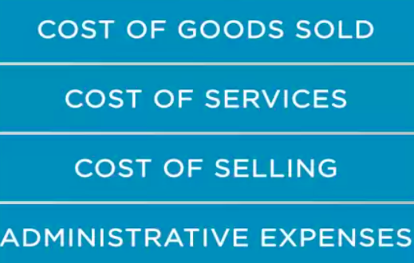

### Strategic Planning based on Financials

Part2

In this session, we'll go through some recommendations on how to support sales planning based on financial aspects.

One of the challenge sales people has is to support **sales planning based on financial criteria**. Here goes a set of recommendations that may be useful. 

* **Profits and losses (P and L) method**

As you saw in the last session, **many sales plans focus on volumes or units to be sold**. Nothing wrong with this approach provided that the P and L analysis is available, and its results have been considered to define sales goals. 

**A typical P and L analysis is similar to an income statement analysis**. You have the sales revenue, then deduct the costs and the profit is available. 

Of course, this is a simplified approach but it reflects the basic concept. **The P and L analysis includes deduction of cost of goods sold or cost of services, cost of selling,general and administrative expenses (SG&A).**

[Salesblog](https://openviewpartners.com/blog/category/sales/#.Xf9v4nVKjCI)

Cost of good sold: 

[COGS]: https://www.accountingcoach.com/blog/cost-of-goods-sold	"COGS definition"
[COGS for software]: https://softwareequity.com/what-every-software-executive-should-know-about-cogs/	"COGS software"

[COGS_software detailed](https://openviewpartners.com/blog/calculating-cogs-for-a-software-company-introduction/#.Xf9u23VKjCI)

SG&A:

[SG&A definiton](https://www.investopedia.com/terms/s/sga.asp)

These cost items are the main ones when analyzing P and L in a product or service context. The table here illustrates the application of P and L. 

We have in the table the revenue from products and service portfolio sales. Also, there is the revenue from non portfolio items, which comes mainly from financial products such as the ones associated with the financing instruments to support sales. Then the deductions applicable are the cost of goods sold or cost of services and selling and administrative costs. The cost of goods sold is straightforward. It represents the direct materials, direct labor and manufacturing overhead costs. The selling and administrative costs are related to incentive programs to stimulate sales people to sale. Administrative expenses are related to the administration functions performed either by the sales backoffice teams or marketing analysis staff. 

Another way of applying financial aspect as a baseline to sales planning is to check the profitability versus cost to serve. 

* **Profitability versus Cost to serve method**

  

Typically, this approach applicability is in **business to business markets**, where the business model may be of medium to long term contracts. The illustration here, shows how to support sales planning through these methods. When serving a customer in a contract based model, it's quite likely that managers have updated data regarding programs, projects and activities to serve the customer. As a consequence, the cost to serve may be available, which allows managers to evaluate the relationship between profits and costs to serve. That said, we can easily conclude that every customer can be located in the chart projected. **The clients that present higher profitability and acceptable levels of cost to serve are the best to maintain. **Whereas customers that present low profitability and higher cost to service should eventually be dropped. This matter demands historical data, so for new prospects, managers have to estimate. Anyway, these evaluation is not completely blind since sales managers know their customer profiles. They also know their portfolio and what would be potential ratio of revenue, profit and cost to serve a new customer of the same profile. **By applying this method, managers can develop the sales planning based on the position each customer or prospect is located in the chart. **This method of course is adaptable. 

Think about the ratio of profitability and volumes.

* **Profitability vs Volume method**

  

 Look at this chart. In this approach, we can see that a similar evaluation process **can point out which customers are indeed more valuable to the company.** This method **contribute to sales planning by identifying the valuable customers.** The decision to serve which customers is subject to discussion at higher executive levels. There will always be a strategic view on the table, which means some of the not so valuable customers will still be kept due to a particular context, such as cross-selling opportunities that they might offer to the company. 

The benefit of applying these methods is evident.**Not all large accounts represent high profitability costs to serve ratio and not all small contracts present low profitability cost to serve ratio.** Of course, the business of the company has lots to do with this type of decision. If the company operates with low margins to gain volume, maybe the customers to focus are not at the high-low location. We always have to remember that the company has competitors and it may be possible that at the high ratio location, many competitive companies may be positioning there and to enter the market would mean to fight for market share. The company may not be prepared to compete against those competitors but against others that focus on the intermediate ratio position, it will be very competitive. I'm talking about defining where to compete and which segments to target. 

Now, let's discuss an approach that makes use of some balance sheet and income statement components. 

* Balance sheet and income statement method

  

In the last session, we mentioned the working capital issue. When the company gives credit to customers by letting them pay days after the purchase. Almost all companies give credit to customers and by doing so they have accounts receivable and average collection periods. This last indicator is the number of days the company takes to convert receivables into cash. 

The average collection period is also known as **day sales outstanding (DSO)**.

[DSO]: https://www.investopedia.com/terms/d/dso.asp	"DSO"

 It has sales in the name, so naturally we can associate indicator to sales, because the credit given to customers will eventually shape the collection period. The calculation is done applying this formula. 

For example, from its balance sheet, a company shows the total accounts receivable of 46,000 and on its income statement it shows the total credit sales amount equals 370,000. So the day sales outstanding is forty five point four days. The company takes close to 46 days to convert receivable into cash. 

Now let's not forget that many customers will ask sales people about the payment terms. It's not necessary to mention that sales planning should have a **policy regarding payment terms**. Otherwise, the collection period will tend to increase with the consequent increase in working capital. This process will certainly reduce profitability and returns. 

We have discussed some recommendations on how to support sales planning based on financial aspects. P and L approach, was the first recommendation. Profitability versus cost to serve was the second recommendation. The third was the use of financial statement components to support sales credit policy making. Violations of these recommendations can be found depending on the particularities of the company. We have discussed that sales planning based on financials of the company. The next session will be about defining sales goals

  

