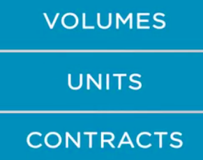
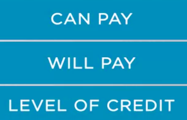
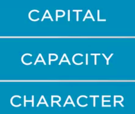

### Strategic Planning based on Financials

Part1

**Sales planning and financials-Part1**

by Nelson Yoshida

his session is about sales planning based on financial indicator.

It's not rare to have salespeople too focused on numbers. I mean numbers, such as, volumes,
units sold, or contracts closed.

We can sell lots of units or high volumes, but what about the profits and losses, the P&L? What about the financial results? 

This subject is a top issue because the **physical goals such as volumes, units sold, market share, or contracts closed, may not generate profitability. **

Managers should care about the P&L. Of course, if the goals are establishing numbers or volume or units sold, maybe the revenue drivers and the costs are already assessed so that the profits and losses are not essential at all. The incentive program would be aligned to the P&L analysis, so salespeople wouldn't have to worry about the results.They just have to achieve their goals. 

 Is that right? Yes and also no. Maybe the best answer to this question, is it depends, on what? 

**How accurately managers have analyzed the revenues** and the **cost to sell or to serve customers.** Also **it depends on the quality of information available to managers. ** Let's not forget management information systems are not unfailing instruments. Should your company be in this case, then achieving the selling quotas could be good and bad at the same time.

 There's also the **credit, pricing, and discounts policies** that may influence the results. Not to mention that **if a selling event doesn't guarantee profits, it doesn't even guarantee revenue**. This later item will only exist if the customer pays for the transaction. 

Salespeople may consider the collection process as management's problem. The selling process is preceded by an analysis of the buyer regarding three important aspects which relates to assessing if, number one, the buyer **can pay** for the exhibition. Number two, the buyer **will pay** for it. And number three, what would be an **adequate level of credit to give the buyer**? 

An evaluation of the question's answers will lead managers to the analysis of buyer's **capital,
capacity, and character, which are commonly known as the three C's of credit.**

Buyer's capital is related to assets, liabilities, and net worth. Capacity is related to buyer's income. And finally, the character is related to the willingness to pay. 

We're talking about credit and collection. Typically salespeople tend to focus on sales, which is not wrong at all. If the sales planning process included credit and collection analysis, then it's okay. In contrast, if this is not the case, then managers should **define credit policy and also collection policy**. 

The common way of doing this is to align with the financial area because credit rating and collection cycles are indicators typically monitored by them. Pay attention also to the size of the contract because **not all large customers are profitable**. Managers have to analyze the **costs to serve customers,** in the sense that if they exceed a certain limit, then the relation between profitability versus cost to serve is unattractive to the company. So by the conclusion, don't neglect this relation.

Let's not forget that every transaction in which the company gives credit to the customer means that you were applying working capital to finance your customers. 

In other words, you might be borrowing money from the bank at high interest rate to finance your customer. And your customer doesn't have to borrow money from their bank, which could be more or less expensive than the cost of capital of your bank. In summary, the issue is the cash management and the negotiation with customers. 

May I remind you of the **accountants' motto, revenue is vanity, profit is sanity, cash is reality! **Remember also that one cost item of marketing and sales budget is the back office  activities. And it may represent a significant amount of the cost of the company. So once a supposed profitable sale contract is closed, the company has to collect the money.

This session was about an overview of the sales planning based on financial aspects. In the next session, we will go through approaches to do it.