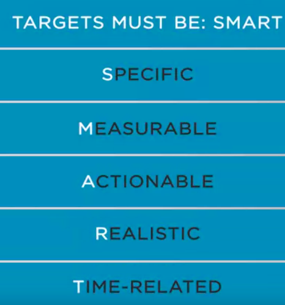
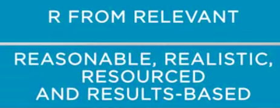
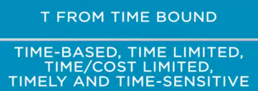

## Establishing Goals and Targets

#### Fine-tuning goals and targets in sales planning

we'll talk about establishing goals and targets. This is a sensitive subject in companies, because it's directly connected with corporate strategy. It reflects in the incentives and compensations for the employees. But this is a subject to be discussed later. 

Now, we will talk about goals and targets, and how arduous this task is. 

First, we have to consider the company's strategies. 

Second, we need to analyze all interconnections, interdependence and integration between areas. Managers need to **deploy the corporate goals in business units and area's targets.**

But do not fool yourself, this work is not easy to do. 

First, we have to consider that the goals need to be **feasible and engage employees. **

These targets might have been developed through a collective collaboration between the sales and all other areas. 

The Harvard University designed a study which followed that **setting a specific goals increase
motivation in employees.**

 There is a well-known acronym, which designates perfectly how targets must be, **SMART.**

 Which means **S is specific, M, measurable, A, actionable, R, realistic, and T, time related. **

The SMART approach used to be attributed to **Peter Drecker**. Do it to **management by objectives ** concept, covered in his book, **The Practice of Management**. However, it was **Professor Robert Robin**, who first wrote about is SMART acronym. Explained that each letter could mean different things to different people. 

It was published in an article for **The Society for Industrial and Organizational Psychology**. He also **clarifies that to be sure that the targets are transparent and they're achievable**

it should follow the criteria.

* S for specific, but also could mean simple, sensible and significant. 

* M for measurable, also could mean meaningful or motivating. 

  

* A from achievable, agreed or attainable. 

  

* R, from relevant, reasonable, realistic, and resourced, and also results-based. 

  

* T from time bound, time-based, time limited, time/cost limited,timely and time-sensitive. 

  

  Another significant contribution from Professor Robin is that **this marked definition would needed to be revisited to reflect the relevance of efficacy and feedback.**

  

   Following this path, some other have expanded the acronym to include this concept by adding the E and R to cover the evaluation and review. 

  

  If you like it, if you enjoy the subject, it's time to go further. 