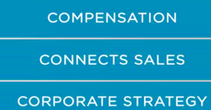
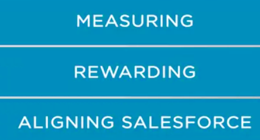
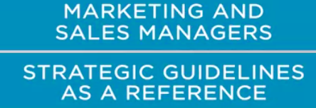
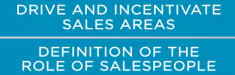
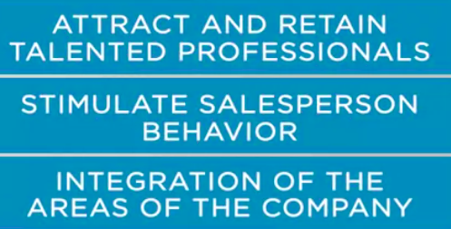
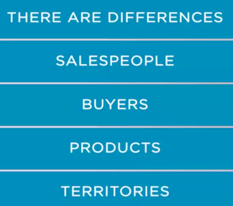
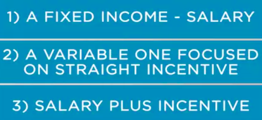
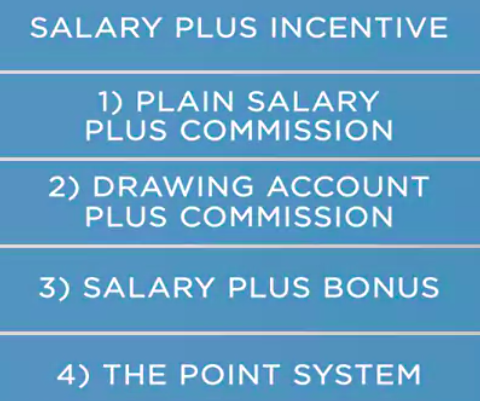
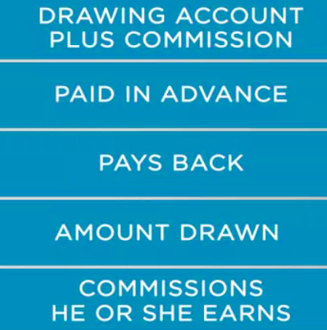
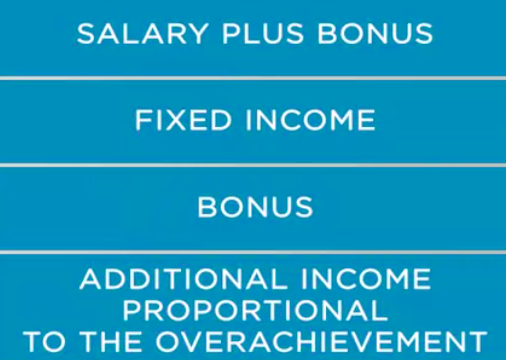

### Incentives,Compenation and Performance Management

we will discuss incentives and compensation programs and the connection with sales. This topic is of crucial relevance, because sales performance is directly related to incentives. A well-structured incentive and compensation model improves sales performance. And let's not forget, the compensation plan is one of the key factors that connects sales with corporate strategy. 

The compensation plan focuses on measuring, rewarding, and aligning salesforce with company goals. 

When thinking about incentives and compensation, we tend to relate it to financial aspects. However, there's a lot of non-monetary items that can  also enhance the incentive programs.

 Incentive and compensation programs are designed to support the salesforce in
their achieving their goals. These programs are typically designed by marketing and sales managers, and to develop them, they use the strategic guideline as reference. 

Most salespeople don't participate in the design of the program, but managers do participate. Even sales managers may have some involvement in the design. At least, the roll-out of the incentive model is a responsibility of sales managers. The benefits of incentives and compensations programs are drive and incentivize sales areas,Facilitate the definition of the role of salespeople. Improve the capacity to attract and retain talent professionals.It stimulates salesperson behavior. Integration of the different areas of the company.

Of course, **incentives and compensation aim to boost sales performance.** And marketing sales managers have to design the program to incentivize salespeople, while at the same time keeping costs under a limited control level. Admittedly, there are differences between salespeople, buyers, products, and territories. So **incentives and compensations programs also have to be flexible. **

Salespeople look for plans which can give them the possibility to obtain satisfactory income. Most compensation programs follow three approaches, **a fixed income, which is salary. A variable one focused on straight incentive, salary plus incentive.**

* The approach of fixed salary may be good for new salespeople. It provides security and stability. However, it may not generate sufficient incentive towards performance. 

* The approach of straight incentive is very good to stimulate people to achieve their goals. However, be aware that managers may have less control on salespeople activities. 

* The third approach, salary plus incentive is a convergent model to use the advantages of the other two approach, and at the same time reducing
  the disadvantages. 

The variations of the salary plus incentive approach can be plain salary plus commission. Drawing account plus commission,salary plus bonus, the point system. 

* The salary plus commission is the most common variation. It comprises 20% to 90% of the salesperson's total income. 

* The drawing account plus commission is a system in which the salesperson is paid in advance. And then pays back the amount drawn from the commissions he or she earns. 

  

* Salary plus bonus is based on a fixed income. And the bonus is an additional
  income proportional to the overachievement of the salesperson. 

  

* The point system is based on the quotas a salesperson has to sell. For every threshold achieved in the quota, the salesperson gains points, and the points are the reference for the commission calculation. 

We have gone through a brief discussion on incentives and compensation models. For more details, see the reading materials as well as the references we suggested.