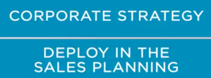
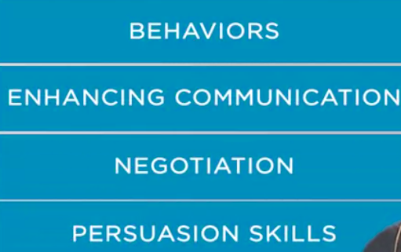
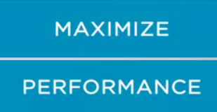
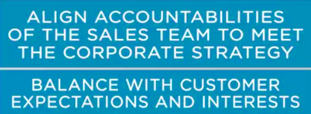

#### Strategic Salesforce Development and Leadership

#### Leading Salesforce development

we are going to talk about something very important, strategic sales for a development and leadership. During our research, we found that many top performing corporations share the common practice of harmonizing corporate strategy to their sales team. As you were already aware, we have developed this specialization in sales from the strategic perspective which is aligned with the market's trends. Another important result of our research was that inspiring and competing leader is the key to the sales team result. Sales teams are essential to a company's success, so organizations need more than a simple manager to reach the goals of a sales team. They need a leader to lead the team through the marketing battle. To become a leader, an active and efficient sales leader, you need to know how to be aligned to your company's corporate strategy to deploy in the sales planning. 

You probably have to ask in yourself questions like, **how can sales teams become more productive when things are increasingly more complex, uncertain, volatile, and diverse?** To answer this and know the relevant questions, a leader in sales needs to master the strategic sales planning process. 

Also, a leader must be aware that for this plan to succeed, this has to encompass initiatives in **how to balance the customers and company's interest, streamline a sales efforts with industrial operations and service development area, set goals and targets, and establish adequate incentives and compensations for the teams aligned with the marketing strategy of the company. **And all of these needs to be supported and integrated with the company's financials.

A sales leader must engage the team and make them believe in their potential. 

A sales leader must guide and train the team to be more prepared to achieve the best results by understanding customers by behavior, enhancing communication, negotiation, and persuasion skills, leveraging the key accounts, and learning to use the competitive intelligence outcome as supports for sales effectiveness. 

This will maximize any sales team performance. 

This guidance will drive a world class sales team. But you need to go further. You need to gain a broader view of different tools available to support you in your analysis and in decision making, develop the capacity to align accountabilities of the Sales team to meet the corporate strategy, and balance with customer expectations and interests. 

You also have to get insights as on how sales planning needs to **cover solutions or value proposition selling process, **and when it's appropriate or not. Finally, you need to be prepared to pursue new insights into the difference of selling to clients in a margin and developing markets to improve the team's abilities and achieve the best results. 

This subject is important and exciting. It also has a lot of content to be studied and read.