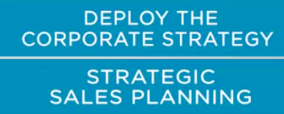
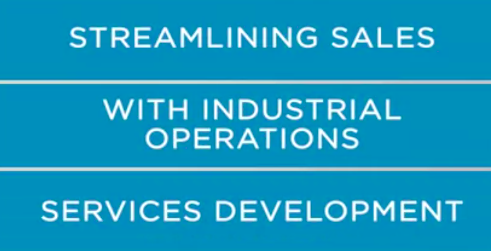
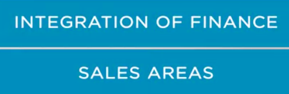
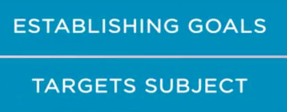
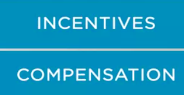
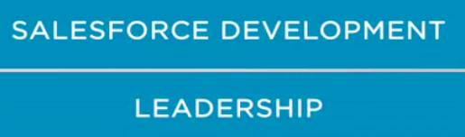

Let's recall what we worked through in this module. 

* First, we discussed how to deploy corporate strategy through a strategic sales planning process.  Marcelo Munerato, the AON CEO, gave us valuable examples and shared his amazing experience.

* In our second session together, we debated how to balance the customers' and the company's interests. Marco Stizzoso, an experienced Marketing Research Executive brought some useful insights regarding customer analysis to support company's decision making in terms of strategy. 

* Our third topic, covered streamlining sales with industrial operations and services, with an excellent and focused participation of Marcos Maricate, Head of Projects and Services at Goss International. And he discussed how a misalignment with sales and product can be harmful to the corporate strategy jeopardizing the long-term relationship between the company and its customers. 

* In the fourth meeting, we had the distinguished participation of Nelson Yoshida, who has a long experience in the integration of finance and sales. We also had the wonderful participation of Alexander Serafi, CEO of Ferric in Brazil, who has also a brilliant career with experience as a Director of Finance, Marketing and Sales. He shared with us his knowledge and expertise clarifying the need for alignment between finance and sales. 

* In our fifth meeting, we covered establishing goals and targets. Mesias Meduru, the Business Head of Nokia Brazil gave us some excellent and useful advice regarding this topic.

* Our sixth subject covered incentives and compensation, and we received Fabio Capitanovus, the Human Resources V.P. of Ambev, a subsidiary of AB InBev, who has also a great career and lots of experience in engaging people. 

* seventh topic covered a relevant subject regarding Strategic Sales, Sales Force Development and Leadership. Gino Olivatto, Country Manager for Q3 Brazil, reminded us how a brave King inspires his knight in the battles for the market, showing how leadership is important to lead people through the sales challenge. 

  You need to be well-prepared and confident to face the battlefield every single day with your team by your side. We believe that the balance between the theoretical approach and real world experience is the best combination to learn something new.

