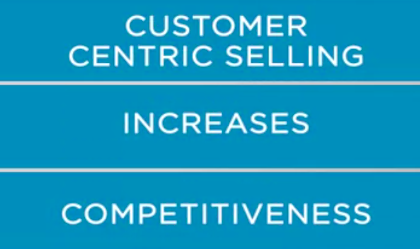
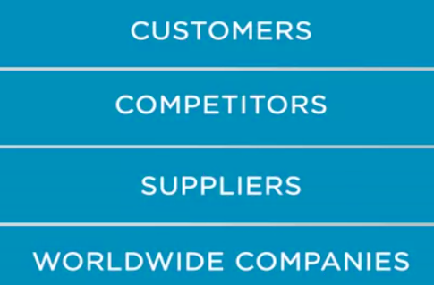
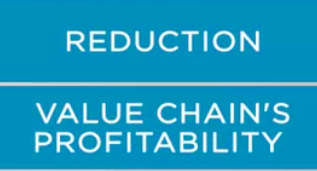

## Why Customer Centric Selling

Customer centric selling is important because it increases the competitiveness and the likelihood of survival and success of companies, in a competitive business environment.

 The nature of the competition is global and brutal. Companies today compete with companies around the world, because foundation of customers, competitors, suppliers, force their competition with worldwide companies. 

Technological evolution is generating processes. Products and services that replace current solutions in the marketplace. On the other hand, customers have access to more information and products and services worldwide, making them more price sensitive and more demanding in terms of quality. 

Which translates into a great pressure to all industries. The practical result is a reduction in the value chain's profitability. 

Companies that can't adapt are being bought or being forced out of the market. The market tends to become more and more consolidated, and the business environment becomes increasingly more aggressive. 

To deal with this new environment, companies have adopted a business model in which they
are increasingly more specialized. In the previous lecture, we talked about how Apple controls a huge supply chain. So we can focus on this end activity, designing great products with easy to use features. This model is different from Apple's business model in the 90s, in which Apple manufactured pretty much
everything, including printing cables.

 In addition to the increasing in specialization, the pressure for financial results has led many companies
to replace their older employees with younger lower salary employees. 

Companies that have gone through this process have realized that young professionals find it easier to deal with technology. But they lack the professional and experience, and that problem is a challenge. In many cases, vendors who are called upon to assist in solving problems that companies would not be able to solve, or would take a very long time, due to the lack of experience from their staff. 

Many companies have chosen to focus on their core activities, and leave secondary activities to more specialized companies and they begin to act as managers of more complex valued systems, acting as integrators.

 in this models, companies prefer to partner with organization that can help solving inclusively more complex problems. There are operational and financial advantages in this kind of arrangement. In this model, the supplier seeks to solve customer problems and to integrate more with the value generating processes. Increasing degration makes switching suppliers more expensive and more difficult. The implication for sales are important. 

