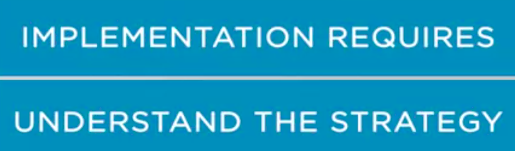
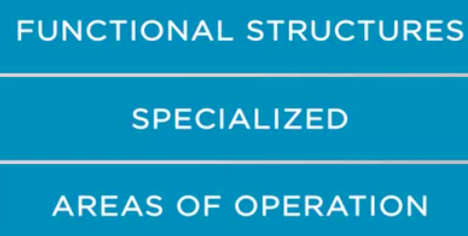
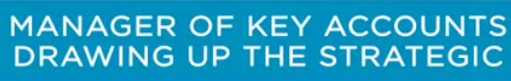
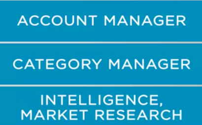
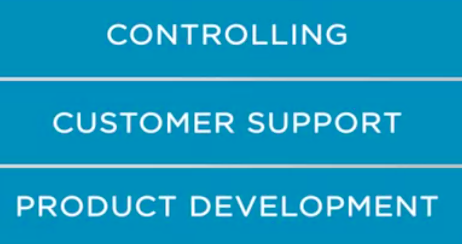
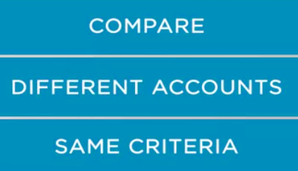
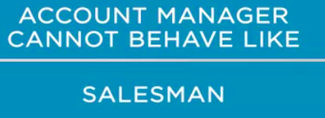

### A new model for a new environment

we will talk about one of the ways companies use to materialize this format. **The account management model is based on the manager's need to deeply understand the customers and the market, which would allow them to build solid strategies and action plans. **

Implementation requires that everyone involved understand the strategy and engage intensively, and
that progress is closely monitored. 

The account management structure has the following elements.

* One, account managers. 

They are the people who have the responsibility of maintaining the relationship with the key clients, and of mobilizing the internal resources of the firm. 

Whereas, some key clients have a global scope responsibility can be divided between the global,
regional, national and sub-regional, or state level account manager. 

* Functional structures are specialized in their areas of operation and that could be **marketing, finance, product development, production, etc. **

These structures serve all account managers who request their support for key accounts initiatives. 

* Three, Geographic Division,These structures can be replicated at each level, global, regional, national and state. 

**The operation:** 

* ​	first, the manager of each of the key accounts is responsible for drawing up the strategic plan for his account based on the overall strategic plan for each company, and mobilize the areas that needs to be supported. 

* ​	Second, each account has a team, 

  ​						

  and with the exception of account managers, members can be part of multiple other accounts. For example, a team may have the following elements, **account manager, category manager, intelligence, market research, controlling, customer support, product development. **

​								

Each of these people is responsible for mobilizing the resources of their respective areas of activity. 

* ​	Third, there is a unique template that all accounts need to use. 

  ​								

  This template ensures that all managers use the same processes and tools in which critical account information is captured. **The strategies, opportunities, threats, key contacts, relative participation goals, financial goals, projects to attack and to defend, progressive projects, etc. **

  a. Information on the competitive environment: opportunities, threats;
  
b. Information on the contacts within the client: decision makers, influencers, decision-making processes;
  
c. Status of ongoing processes and negotiation;
  
  d. How the Key Account leaders perceive the market, their competitors and themselves;
  
  e. Values, beliefs;
  
  f. Capabilities;
  
  g. Current and future strategies;
  
  h. Internal processes;
  
  i. Historical records of all the interactions between the firm and the customer.
  
  
  
  The great advantage of standardization is that, 
  
  * in case of a need of exchange, the information is preserved and the transition happens more smoothly. 
  
  * In addition, when a company becomes familiar with the process, they can compare the situation of the different accounts using the same criteria. 
  
    

* Fourth, each area involved in managing the account **has access to the area that contains the information they need to work, no more and no less**. Their access is done through their password. This precaution is necessary because of the risk of information leakage. For example,
  each account manager has access only to the market potential in the segment in which it operates. The marketing person only has access to the information they need within each account. 

* Fifth, the process is designed  to also serve as tool for follow-up for major projects. 

  ​            						

* Sixth, **the system can be interconnected to other tools.** For example, one of the systems
  I studied had a part dedicated to key account employees and he was connected to LinkedIn. When employees updated their profile on LinkedIn, this update could be viewed through the system.

* Seventh,** the precise followup is done in a regular, monthly, quarterly and annual base.** During the year, the strategy is evaluated and modified if necessary. 

* Eight, **when the account managers identify a customer need that the account management team evaluates that can not be satisfied with internal resources, the team look for options for external partnership with other organizations. **

The success of this system depend on several factors. 

* The first, is communication between teams. These systems require areas to be able to work effectively as a team. 

The account manager cannot behave like a mere salesman who pushes what his firm produces, but he must establish a deep and open dialogue with client in order to identify the client's needs and generate solution. 

Which may or may not include the contribution of other companies. 

* Technical knowledge is mportant, but it is not enough anymore. All areas represented by the account team need to increase their business knowledge and understand the client's business from the strategic, technical, and operational point of view.

 This change in the functioning of companies fundamentally changes the relationship with customers.