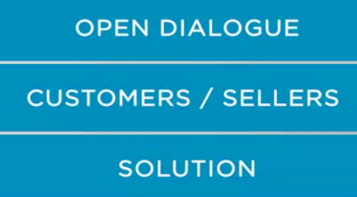

## How relationship between Companies has changed - Why does it matter

We talked about how the changes in the market led to a significant increase in the competitiveness of the market as a whole, and generated new forms of relationship between customers and suppliers aimed at the long term relationship. 

With the customer centric sales, the relationship between suppliers and customers has changed. **Suppliers aim to help customers achieve their goals, solve problems, and meet their needs.** 

**The communication between suppliers and customers is less focused on negotiating prices and more focused on the discussion and resolution of customer problems.**

It is a dialogue, not a presentation 

in which the sellers try to promote their products and services. By establishing an open dialogue, customers and sellers often come up with a solution that involves elements from sellers from several other markets. 

To analyze customer issues, vendors need the skills to use a specialized and sophisticated tools which will be presented in the **sales intelligence model to understand the customer's business model, strategic moves, strategic and operational options. **

Without these tools, it is nearly impossible for the vendor's employees to share a common vision with customers.

 In addition, vendors will need to understand the customer's internal processes so that they can gain insights and propose solutions. 

The ability to analyze processes of the customer value generation requires another set of specialized tools. The decision to support customers and solve their problems also generate changes in the relationship between the internal areas of the vendors. 

Other areas are needed to get more involved in understanding and solving customer problems because seldom will the salespeople have all the technological knowledge needed for an interaction with multiple areas, and a solution will involve several internal errors and often the participation of other company more specialized in other areas of operation.

 The scope and responsibility of the salesperson with the client increases considerably. 

Its role is to be one of leadership and relationship management to generate better options and maintain a long term relationship. 

The change in the nature of a relationship between customers and vendors is profound and affects the operational side of both companies requiring new knowledges and skills. 