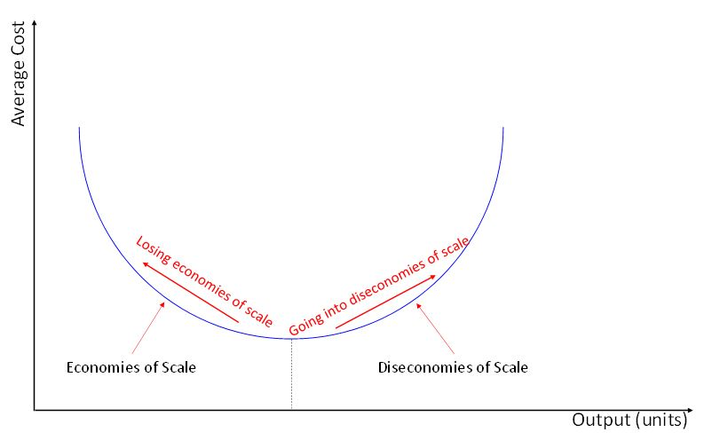

**The Assignment Rubrik is at the end**

**Assignment READING**

**The industry - Introduction**

The printing and graphics industry includes much more products and services than what most people can imagine. When people are told about printing and graphics industry, common sense leads them to think of newspapers, magazines, books, and other popular printed products.

Undoubtedly, many other applications demand printed products and services. Just to mention a few of them: products packaging, products catalogs, promotional folders, didactical books, manuals, posters, notebooks, and discount coupons are known examples of the other applications.

The industry is a typical business-to-business (B2B) example. Sales are developed by salespeople who interact with buyers of the customer side.

One can imagine many salespeople with diverse expertise and backgrounds, who work throughout the value chain of the printing and graphics industry. The variety of scopes is extensive and may be complex, depending on the nature of the company.

Some companies offer the final printed materials, such as posters, magazines, newspapers and commercial folders, just to mention few examples. In these cases, it's easier to have a picture of the final products, what they are made of, and which materials, components, and services comprise the packet of solutions delivered to customers.

Other companies, instead, may have a portfolio that is hard to picture for most of the people. The manufacturers of the printing machines, for instance, are very distant from the majority of the population. They offer solutions for customers that provide the products and solutions that are closer to what people are used to having a contact in their day-by-day lives. However, the nature of their business is not commonly known, only specialized professionals understand it.

Even though most people have direct contact with the final product, as consumers, for most of them, it’s too difficult to realize what processes, what kind of companies, or what professionals participate in the manufacturing or the production of the printed artifacts. Anyway, those companies and professionals work to make things done as expected.

It’s not too much to remember that we may not perceive the processes and steps through which the printing and graphics industry goes, but it doesn’t mean we cannot understand the challenges involved in this industry. And it’s appropriate to mention, especially in these days which many different medias have played a vital role in demand for printed materials.

The companies of this industry value chain operate in the digital format. However, it doesn't mean they have abandoned the analog form. A combination of the formats has been applied by players in the market (Marx, 2015).

As mentioned, the value chain of the industry includes the printing machines manufacturers, integrated printing service providers, designers that develop the content to print, and many other players that are part of the printing and graphics market. And this list should include, of course, other fundamental players, for instance, the consumers of printed material, which can range from newspaper companies, magazine editors, packaging industry, food industry, and other players that consume printed materials of different natures. Let’s not forget to include us in this value chain, since every single product we purchase comes in a package that very likely has a printed message of some kind on it.

A natural consequence of this diversity of players in the sector is the variety of professionals in the sales areas of these companies. Their knowledge, expertise, skills, and attitudes may vary a lot depending on the category of the company they work.

In this business case of Course 1 - Effective Sales - An Overview, the focus will be on the printing machines manufacturers. The questions of the assignment project will have this reference, the challenges of the industry also will follow the same standpoint, and especially the peer-review instructions will focus on this approach.

**The challenges of the industry**

At the beginning of the printing and graphics industry, long ago, the challenges were more concentrated in the technology advancements to improve the throughput of printing, reduce the cost of printing one single unit, and fine-tune the quality at the same time.

In recent times, the challenges are much more complicated, since many different media have been created since then. The evident challenge of current days goes beyond; today, new technology platforms can provide the means to send the message that, in the past, were most of all in the hard copy printed format.

The direct impact is that the demand for the printed format is decreasing, partially substituted by the digital media. What was once consumed in printed form in the past, is consumed in digital image form today.

By consequence, the average customer demand also reduced for each unitary order; for example, orders of 100,000 units in the past may be around 10,000 units in recent times, just to mention an example. The impact of this new context is that a printing business company has to sell more contracts to print the same number of items as it used to print in the past. However, the costs to sell each additional contract, and also to serve each additional customer are not in the same proportion as it was in the past. They are admittedly higher in a unitary contract basis, which means the company will take more time to dilute the contract acquisition costs.

In such a context, margins trend is of decrease because of the fragmentation of medias and smaller orders for each of them.

The phenomenon that the industry has been experiencing today is in the list of, either losing economies of scale or going into diseconomies of scale.

The illustration below can show how each of the situation can occur.

In the past, if the company was adapted to operate at a determined throughput output (equivalent number of printed pages), it might have limitations do downscale the operations in the new business environment.

The company has to adapt the operations at a decreased level of throughput, which means it would be increasing the average cost to serve. This move to downscale operations characterizes a situation in which the company is losing the benefits of economies of scale. The company would be on the left half of the graph, moving upwards to the left, increasing the average costs to serve.

On the other hand, if the company sales area is increasing the number of contracts and the total printed pages, it would potentially be adding value. However, an extra proportional effort should be made to add more contracts, which illustrates a situation of increasing the output (equivalent number of printed pages) and also the average cost to serve at the same time. And this situation means the company is going into diseconomies of scale. The company would be on the right half of the graph, moving upwards to the right.

In this business context, the challenge ahead printing and graphics industry is enormous, and the extent to which the changes in the market will impact the industry is an uncertainty for executives.

Taking the discussion to the sales arena, one can assess the strategic analyses that sales managers have to develop are not simple. Not only the strategy analysis has to be carefully done, but also every other aspect of the strategy roll-out processes, such as corporate planning, the budgeting process, and of course, the sales planning process too.

Sales leadership play a crucial role in this process because it’s not only about sales function, but also, it’s about managing sales and program management, with many different projects within it. Sales leaders should present knowledge, competencies, skills, and attitudes to support the salesforce and obtain the best from salespeople commitment.

In a nutshell, the companies of this industry are under pressure. Their senior executives face a strategic issue, which shapes not only their business models but especially the approaches the companies’ managers adopt in the relationship with customers. That, of course, has much to do with the sales functions.

**The focus of the case: Printing machines manufacturers**

As for this case, consider you are a sales manager of a printing machine manufacturer. This company designs, builds, delivers, do the setup of the delivered machines, and provides post-sales services, such as preventive and corrective maintenance. The company commercial geographic scope is regional, in a sense, it sells to customers within your country, and also to customers of neighbor countries.

In the sector of the company you work for, there are three major technological solutions:

**1) Rotogravure:** This printing technology is fit to support high volumes of production, which should lead to low unitary costs of printing. You can find illustrations of printing machines on the internet, by accessing websites like *www.machineryeurope.com/gravure-printing*

*https://dir.indiamart.com/ahmedabad/rotogravure-printing-machine.html* .

In this technology, the printing cylinder is the mechanism that transfers the ink to the substrate, which is paper, typically.

The cylinder has to be prepared for each content to print, and this process is costly. Therefore, a rotogravure printing infrastructure only pays-off with high volumes. Low to medium demands don't fit in a rotogravure infrastructure.

At this point, it's made clear that this kind of machine demands ample space for the installation. Initial capital expenditure (CAPEX) to purchase a rotogravure machine is exceptionally high. Every project of a rotogravure machine purchasing requires time to negotiate, many specification adjustments meetings, visits to onsite operational installations, and of course many commercial meetings, and contacts by phone or teleconferences.

There’s extra care in the negotiation process, due to the high capital expenditure to purchase an infrastructure for rotogravure printing. It’s a commercial engineering sales process, it demands consultative approach, and it also must constantly be realigned because the scope of what the customer will do with the machine influences the pre-specification process.

**2) Offset printing:** Offset printing is an excellent printing method. It can be categorized in the conventional (wet) offset printing and the dry offset printing. The presence or absence of water in the printing process defines which category the machine is classified.

It also demands significant investment to be purchased. It's the most common technique employed for printing of newspapers, magazines, maps, brochures, books, leaflets.

Therefore, the typical substrate is paper.

This technique doesn't apply well to any substrate.

The technology is used in applications that demand high-quality printing, good printing throughput, and an acceptable unitary cost in the pre-preparation work.

One of the advantages of the offset printing is that it presents lower costs to pre-prepare a printing job, compared to the rotogravure printing technology. The current market share of this method is approx. 60% (*http://www.machineryeurope.com/offset-printing* ).

**3) Flexography printing:** This method is applied on different substrates, such as paper, plastic, metal, corrugated cardboard, and film, to mention some of the materials on which the printing can be made.

Because of this diversity of substrates, one of the most common applications of flexography is in the packaging industry.

The method principle is one of the most intuitive because it derives from the old school letterpress printing, which produces the printed images by applying a raised area covered by fast-drying ink.

A rolling cylinder is also used to speed-up the throughput of printing. Over the cylinder, a flexible printing plate is wrapped, and this is the ink transfer mechanism in the process. A characteristic of the flexography printing method is that since the printing plate is flexible when it is wrapped around the cylinder, it stretches. This phenomenon makes the images of the printing plate look bigger on the substrate, which means they have to be made smaller on the printing plate to generate a final image at the desired size on the substrate.

Based on the brief description of each method applied on the printing machines, one can quickly realize that the salespeople involved in the business of the printing machines manufacturers have to know their products and services to a very high level. It's a consultative selling process, not a transactional selling approach.

Of course, the buyer-side professionals are expected to know the different technologies and their characteristics. The professionals involved in commercial negotiations related to printing machines platforms interact heavily during the process. Negotiations may take months to be carried on, and since CAPEX required is high, the process may have ups and downs.

Specification meetings, the definition of services included in the pre-sale and post-sale phases are typical subjects negotiated in the sales process. Some parameters can be customized for each customer, and sometimes the manufacturer may have to develop specific adjustments to fulfill a customer request.

Also, it’s necessary to mention that companies can improve the technology during the time, by developing innovations, adding new features and capabilities to the existing machines. Or they can even develop a new machine from scratch to follow the scenarios of demand for the future. In this process, strategy and marketing analyses are necessary to support the definition of which technological roadmap to follow.

Of course, salespeople also have to participate in this innovation process, due to the needs identification they can perform with close contact with customers. In such a case, it’s quite likely that senior management, marketing, and sales professionals will work with integration. However, this logical conclusion might not reflect the whole truth, as there might be some dissonance in this process. Marketing people tend to be more focused on medium to the long-term horizon; while salespeople might be focused on the short-term. Marketing people would be more focused on the market trends, while salespeople would be more focused on the customer's tendencies. And, let’s not forget, since this industry is characterized by a high consultative selling approach based on technical knowledge, salespeople tend to be empowered.

The dynamics of the interactions of professionals of suppliers and customers have much influence in the selling process, and it's not hard to realize that many people from the negotiating parties participate in this process.

This highly participative and multidisciplinary characteristic is what makes the selling process a complicated matter for the professionals of this industry. This context also makes the incentives and compensation model present some particularities. Also, the goals and targets establishment become challenging due to the high value of negotiation.

Typically, an incentive program model is designed to compensate the efforts to perform in sales, and most common products and services are not high-priced like printing machines. This characteristic brings the challenge to fine-tune goals and targets for this industry, which will eventually influence the incentive and compensation model.

The leadership in sales has to be played in a high-level standard, with a combination of technical knowledge, coaching and mentoring processes, business ethics, customer orientation, commitment to deliver value to customers, people management for improved performance, and monitoring and controlling job stress.

There’s an important remark that should be done at this point. Some salespeople might have a misperception that whenever the word “value” is mentioned about customer serving, it’s in a sense that the value is something the company is negotiating in a short-term trade-off basis with the customer. In other words, by this standpoint, the customer is bargaining for discounts, and the company (supplier) is bargaining to reduce the discount. The bargaining process is not the point of the shared value concept, which has mostly a medium to long-term time horizon, not a short-term.

**The strategic challenges**

It has been noticed that circulation numbers for local and regional press are decreasing, it is apparent that this trend will continue due to the new media of communication.

This business change, combined with the decrease in marketing expenses due to the economic crisis in some countries bring an impact on advertising investments. Some players in the market, for example, publishers, have been able to mitigate the declining advertising revenue by raising prices, but this approach may not be applied in the long-term. A second order effect of increased price is that the substitution process, from hard copy materials to digital imaging in alternative media is accelerated by this approach.

Not to mention that more and more people access their news online for free using their smartphone.

Consumers of printed materials present a change in their consumption behavior. By consequence, different factors may have an impact on the demand for graphics services and products.

**1)** For instance, **consumers** are moving towards **online shopping**, which can be done with no hard copy printed material. This **change** **in** **behavior** has a direct impact on the willingness to invest in advertising, which affects the demand for printed materials. This effect is magnified because potential customers of graphics materials tend to perceive the market turndown and decide to invest less than they used to do before. By consequence, an overall reduction in demand for advertising folders, advertising in magazines, promotional catalogs, discount coupons, and newspapers have been noticed in the market.

**2) Environmental issue:** Another factor associated with the change in consumers behavior is the environmental issue. People tend to appreciate the alternative media of digital communication because there’s no wasted material to go to the garbage can. The fact that the communication through digital media delivers the message, and therefore there’s no waste in this process, illustrates the perspectives of this channel.

In a nutshell, online shopping has attracted the demand for advertising, and most of the transactions use zero hard copy printed materials.

**2) Iddle capacity | Overcapacity:** Mostly caused by the reduction in demand for printed materials. Also, part of this overcapacity comes from the increase in competition from new players in developing countries. The pressure on margins has been rising in the recent years, and overcapacity is one of the critical drivers that trigger this situation.

Not only final customers are cautious in investing in hard copy printed materials, but also their services providers become more conservative in their future investments plans, due to the uncertainties in demand for printed materials.

**3) Economy:** The demand for printed graphics products and services is sensitive to the economic situation. The economic conditions impact the whole value chain of the graphics industry.

Some of the variables that affect the demand may be the disposable income, the Gross Domestic Product (GDP) growth, the exchange rate of currencies around the world.

Also, a relevant factor in the economic front is the flow of international investments. Some countries might be good investment place due to their economic perspectives, their advantages in the currency rate, their availability and easy access to materials suppliers, logistic aspects, and also people who can be trained and become skilled professionals to perform in the industry.

Of course, location is a relevant topic when analyzing the availability of the printed material and where it is demanded.

**4) Supply materials:** Costs of raw materials have increased, and also customers’ requirements have changed, which contributes to costs increase because the orders tend to be stratified in different solutions of printed media and the numbers for each solution have decreased. This phenomenon has accelerated the increase in the unitary costs.

**The problem in focus**

The executives of the company you work for are analyzing strategic alternatives to the challenge your company is facing.

Ideally, the company's demand would be generated by the traditional way of doing business. However, the market is changing, the demand is decreasing, and new media means have captured part of the potential market share.

The major variables that characterize the printing machine manufacturers business continue to present the same aspects, such as the need for high capital investments, high costs to prepare a new printing job, and the sensitivity to the volume of pages and the unitary cost of each printed page.

As mentioned before, the decreasing demand leads the companies that are customers of printing machines manufacturers to lose margins. Unitary costs increase, and total revenues tend to stabilize or even decrease.

The context described so far indicates the customers that may be considering to buy a printing machine, be it of any of the technologies before mentioned, are becoming more and more conservative in the investments plans. Their concern is about the perspectives of demand for printed materials in the medium to long-term horizon, which is one of the key drivers to the decision-making.

Yes, admittedly, this is a case about SALES, and some of the major variables that are involved in this case are strategic issues that might look like a non-sales issue. But, doesn't it have connections to sales, somehow?

Listing a sequence of questions related to the topics discussed during the Course 1 of this Specialization, we can contextualize the variables that may relate to the sales functions. And these relations are the subjects that will be developed in the case analysis assignment.

The questions of the instructional packet of the assignment are regarding the challenges of the sales function, with the standpoint of a company that is in the printing machines manufacturing business.

This case doesn't have quantitative data because the scope of the assignment is related to the qualitative aspects of the sales challenge.

----------

**Strategic Sales Management In Action: Our Journey Begins**

The assignment of this course has its primary focus on the challenges of the printing & graphics industry, which presents some strategic issues regarding the nature of the business and, by the consequence, some impacts on the sales function.

A typical Business-to-Business (B2B) context is the characteristic of this industry. Therefore, the sales function to support the negotiations of the companies within the value chain applies a consultative sales approach.

To develop this assignment, please follow the instructions below.

1)	Read the case with attention.

a.	Keep in mind that you don’t need to consult any additional material to develop your analysis.

b.	The case is based on a real-life situation. Names, characters, and geographic information are changed for the sake of confidentiality.

2)	Analyze the questions prompts in this document, and discuss the topics related to each of the questions, by providing your analyses results.Follow the instructions provided in the prompts/questions.

3)	If needed, we strongly recommend you review the lessons of Course 1.

4)	This assignment is a peer-reviewed project; therefore you’ll have two opportunities to go through learning insights: (1) By developing your project/assignment; and (2) by evaluating a peer Learner project/assignment.

**Review criteria****less** 

Grading method will follow the evaluation method provided by the assessment rubrics.

The instructions of how to apply the rubrics are available here, with the prompts and questions.

You have to achieve 80% to pass the assignment.

**Note 1**: You have to submit your assignment before being able to review another submission.

**Note 2:** Please observe due date to deliver the submission.

**Note 3**: Keep in mind the suggested deadline for completing reviews is 3 days after that of the suggested deadline of the assignment

**Instructions and Learning Goals**

This assignment will be developed through a business case that instructors designed from a real-life situation.You, as a Learner, will **apply the concepts discussed during Course 1**, **identify critical issues** within each of the questions, **analyze** them, and propose **critical analysis conclusions**. The assignment instructions and questions will inform the rubrics for each of the assessment criteria items to develop the peer-review.

The case brings a business context that demands critical analysis on the sales function. Not only from a specific sales-only standpoint, but also from a broader scope of analysis, which is what instructors, participants, and interviewees have discussed during the Course 1.

The estimated total time to develop this assignment is between 4 to 5 hours. This estimation includes reading the case, the assignment instructions, and peer-review instructions, developing the project by answering the questions/prompts, and finally reviewing the project of a peer-Learner.

We expect that the time to develop the assignment will partially be dedicated to reviewing some of the lessons within the three conceptual modules of Course 1.

-----------

