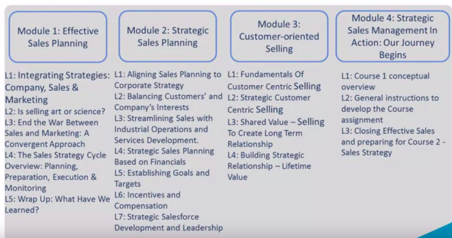
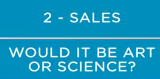
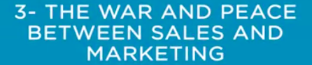
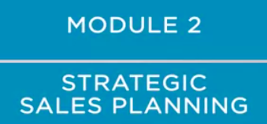
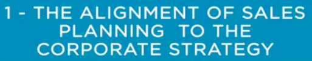
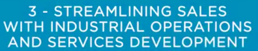
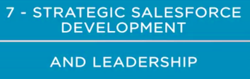
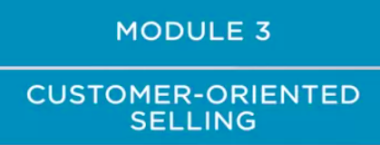

## Conceptual Review of the Course

* The core concept in this course is effective sales, which has many implications that go from the strategic scope to the operation of the sales function. 

  

*  In module one, we discussed sales planning with some general prescriptions and recommendations on how to do it effectively. We went through four lessons in module one, each regarding a relevant topic such as, one, 

  * integrating strategies within the company with aspects that relate to the marketing and sales areas and also to the other areas of the company. 

    

  * In topic two, we also brought some reflections regarding the sales function, would it be an art or a science? We proposed that we should treat it a bit more like a science, which means applying concepts, models, tools, and techniques which contribute to support sales planning. But we do it with no disregard to the sense of art, which admittedly is something that does bring a contribution to sales. 

  

  

  * In topic three, we discussed the war and peace between sales and marketing. In this topic, we discussed the classic issue of the complex relationship between these two areas of the company. Some recommendations on how to align these two areas were made, as well as how to lead this alignment towards a more integrated model and drive the company to a value creation solution. 

  

  * In topic four, we went through the main concept of the sales strategy cycle overview, including, in this process, the phases of planning, preparation, executing, and monitoring. 

Well, in a nutshell, module one introduced the major concepts that support an effective sales planning process. 

*  Now, talking about module two, we discussed the fundamental concepts of strategic sales planning. So, the scope of the second module is to go into more details on how to develop sales planning with a strong connection to the company's strategy. 

  

* Therefore, the topics we analyzed in this module included, 

  * one, the alignment to sales planning to the corporate strategy, which is a classic challenge the managers have to face. 

     

  * Topic number two is balancing the customers' and the company's interests. This is very important because ideally, the sales function should generate benefits for both sides. However, it's not rare a situation in which one of the sides has an advantage or even a disadvantage. And this isn't good for business because eventually, one of the parts will break the relationship.

    

  * In topic three, we discussed the issue of streamlining sales with industrial operations and services development. This subject is crucial for the company because it's one of the most important aspects that make the value proposition visible to the consumer. 

    

  * Topic number four discusses the financial aspects that also play a vital role in the sales planning process. Typically, the shareholders have strategic goals at the corporate level, which may include broad financial goals for the company. These goals drive the sales planning process. And here, we have the connection between sales planning and financial aspects. 

    

  * In lesson five, we discussed the topic of establishing goals and targets for the sales area. This topic is a major responsibility for managers because it contributes to building the transition between corporate strategy and sales strategy. 

    

  * In topic number six, after analyzing all the topics related to goals and targets, we went through the discussion of incentives and compensation, which is a fundamental component of a well-structured marketing and sales plan, that aligns well with corporate strategy. 

    

  * In topic seven, finally, we concluded the second module, which was about strategic salesforce development and leadership.

    

 In this lesson, we emphasized that successful strategic sales plan depends on effective leadership. I would also like to mention that in module two, we had the participation of many top-level executives who were interviewed and shared their knowledge and valuable experience on the subject.

* In module three, we focused on customer-oriented selling. This approach aims to create value for the company through enhanced customer satisfaction. 

  

* In module three, we discussed several topics. 

  * Number one is the fundamentals of customer-centric selling, which covers the concept of creating shared value for both parts, company and customer. 

    

  * Topic number two was strategic customer-centric selling. And in this lesson, we discussed the potential results that may come from a focus on customer satisfaction. This approach is strongly connected to the strategic guidelines in the sense that the corporate strategy should provide clear guidelines to support it. 

    

  * Topic number three is shared value through strategic selling function. This lesson was about building a long-term relationship and how it can contribute to create shared value. 

    

  * Topic four is building strategic relationships and lifetime value. In this lesson, we discussed how a collaborative relationship with clients can foster a continuous selling opportunity. 

    

Next, we'll briefly talk about the instructions to develop the final assignment for course number one.